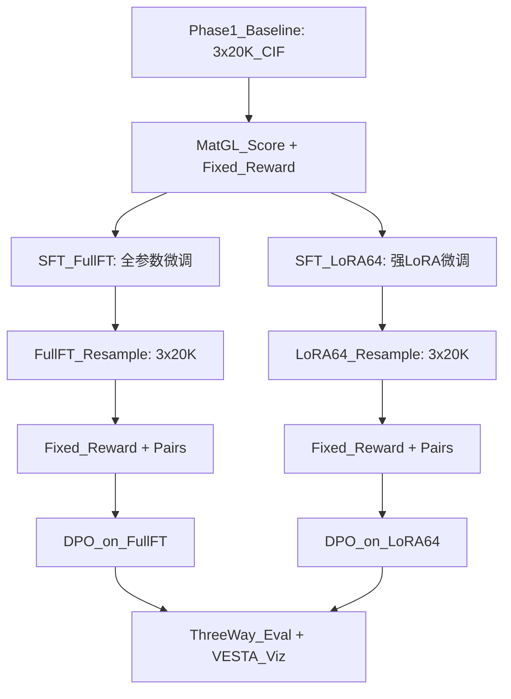

# 修复 Reward 正则项 + 数据多样性 + SFT+RL + VESTA 可视化

## 问题诊断

前次 `exp_sft_rl` 实验中导师三条建议虽然写了代码，但 **没有真正生效**：

- **R_difficulty = 0.88 固定**: pymatgen 返回 Unicode 空间群符号（如 `Pna2₁`），但查找表用的是下划线（`Pna2_1`），匹配永远失败 → 全部 fallback 到 0.88
- **R_structure = 0.9998**: 阈值过松（NN [0.5,4.0]A, vol/atom [5,100]A³），几乎所有合法结构都得满分
- **SFT 无效果**: LoRA rank=16 + LR=5e-8 太保守，仅训练 `c_attn` 层，对 25.9M 小模型几乎无影响
- **采样多样性**: 温度/top_k 是 per-batch 而非 per-sample，且基线生成根本没启用

---

## Phase 1: 修复 Reward 函数（建议 1）

### 1a. 修复 R_difficulty — 空间群符号标准化

文件: `[scripts/48_compute_composite_reward.py](scripts/48_compute_composite_reward.py)`

- 在 `compute_r_difficulty()` 中，对 pymatgen 返回的空间群符号做标准化：将 Unicode 下标（₁₂₃₄₅₆）替换为 `_1 _2 _3 _4 _5 _6`
- 同时支持按空间群编号查找（更健壮），新增 `SG_NUMBER_TO_STABILITY` 映射表
- 预期效果：R_difficulty 将从固定 0.88 变为 **0.60~0.996** 的连续分布（Cmcm=0.60, P2₁=0.996）

### 1b. 修复 R_structure — 使用连续打分替代二值判定

文件: `[scripts/48_compute_composite_reward.py](scripts/48_compute_composite_reward.py)`

当前逻辑: `在范围内 → 1.0, 否则 → 0.0`（二值判定）
修改为: **高斯型连续打分**，以参考数据库的均值/标准差为中心

```python
# 例：NN 距离打分
mu, sigma = 2.0, 0.5  # 参考均值和标准差（可按组分调整）
nn_score = exp(-((nn_dist - mu) / sigma)**2)
```

- 对 vol/atom 和 density 同样改为连续打分
- 参考值可从训练集的稳定结构统计得到
- 预期效果：R_structure 从恒定 0.9998 变为 **0.3~1.0** 的连续分布

### 1c. 新增 R_symmetry_diversity 维度（可选）

鼓励模型不要总是生成同一种空间群：

- 计算当前 batch 中空间群的熵
- 高熵 → 高 reward

---

## Phase 2: 增强数据多样性（建议 2）

### 2a. Per-sample 采样随机化

文件: `[scripts/40_generate_cifs_crystallm.py](scripts/40_generate_cifs_crystallm.py)`

- 将 temperature 和 top_k 的随机化从 **per-batch** 改为 **per-sample**
- 每个样本独立采样 (T, k)，增加输出多样性

### 2b. 增加样本量

在 `[experiments/exp_sft_rl/config.sh](experiments/exp_sft_rl/config.sh)` 中：

- `NUM_SAMPLES` 从 10,000 提高到 **20,000**（每组分）
- 增加不同 seed 的生成（如 seed=42,123,456 各生成一批再合并）

### 2c. 多 prompt 变体

为每个组分生成多种 Z 值的 prompt：

- LiFePO4: Z=1(`data_LiFePO4`) + Z=4(`data_Li4Fe4P4O16`)
- NaCl: Z=1(`data_NaCl`) + Z=4(`data_Na4Cl4`) + Z=8(`data_Na8Cl8`)
- 不同 Z 值会引导模型生成不同大小的超胞，增加结构多样性

---

## Phase 3: SFT + RL 两阶段（建议 3）— 消融对比

### 3a. Full Fine-Tuning SFT

- `strategy=full`, LR=5e-7, steps=4000, grad_accum=4
- 全参数训练，更激进的分布偏移
- 风险：可能灾难性遗忘 → 监控生成有效率

### 3b. 强 LoRA SFT

- `strategy=lora`, rank=64, target_names=("c_attn","c_proj","mlp")
- LR=1e-6, steps=6000
- 扩展到 MLP 层 + 更高 rank + 更高学习率

### 3c. DPO 阶段（基于更好的 SFT + 修复后的 Reward）

- 使用修复后的复合 Reward（R_difficulty 和 R_structure 真正有区分度）
- 偏好对将按真正的 R_total 排序，信号更强
- Reward-weighted DPO loss 中的 reward margin 将有实际意义

### 管线流程




---

## Phase 4: 安装 VESTA + 结构可视化

### 4a. 安装 VESTA

- 下载 VESTA 3 Linux x86_64 版本到 `/home/liuxiangshuo/tools/VESTA/`
- 添加到 PATH

### 4b. 新建可视化脚本

新建 `scripts/51_visualize_structures.py`：

- 从评估结果中挑选 Top-10 稳定结构（按 Ehull 最低）
- 对每个 CIF 调用 VESTA CLI 生成高质量 PNG
- 同时为 Baseline / SFT / SFT+DPO 各选 Top-10，做对比可视化
- 输出到 `reports/exp_sft_rl_v2/visualizations/`

### 4c. 论文级可视化

- 晶体结构 ball-and-stick 图
- 标注空间群、晶格参数
- 对比面板: Baseline vs SFT+DPO 的代表性结构

---

## 文件变更总览


| 操作  | 文件                                       | 说明                                      |
| --- | ---------------------------------------- | --------------------------------------- |
| 修改  | `scripts/48_compute_composite_reward.py` | 修复 R_difficulty 符号匹配 + R_structure 连续打分 |
| 修改  | `scripts/40_generate_cifs_crystallm.py`  | per-sample 采样随机化                        |
| 修改  | `scripts/33_train_sft_crystallm.py`      | 扩展 LoRA target_names 到 MLP              |
| 修改  | `experiments/exp_sft_rl/config.sh`       | 新超参（NUM_SAMPLES=20000, 两种 SFT 配置）       |
| 修改  | `scripts/run_sft_rl_pipeline.sh`         | 支持消融对比（两种 SFT 分支）                       |
| 新建  | `scripts/51_visualize_structures.py`     | VESTA 结构可视化脚本                           |
| 新建  | `experiments/exp_sft_rl_v2/config.sh`    | 新实验配置                                   |
| 安装  | VESTA 3 (Linux x86_64)                   | 下载到 ~/tools/VESTA/                      |


## 预计时间

- Phase 1（修复 Reward）: ~2 小时代码
- Phase 2（多样性）: ~1 小时代码
- Phase 3（SFT+RL 消融）: ~3-4 天运行（两条分支并行不了，需串行）
- Phase 4（VESTA + 可视化）: ~2 小时（安装 + 脚本）

