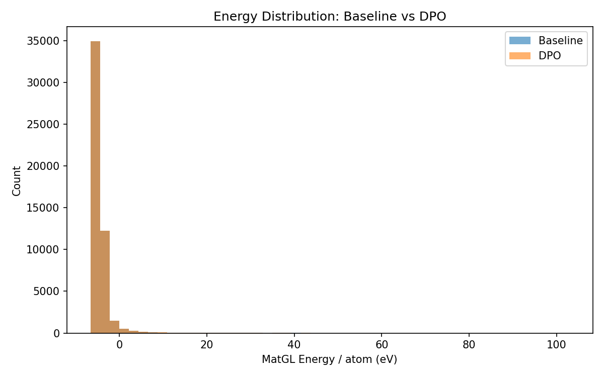
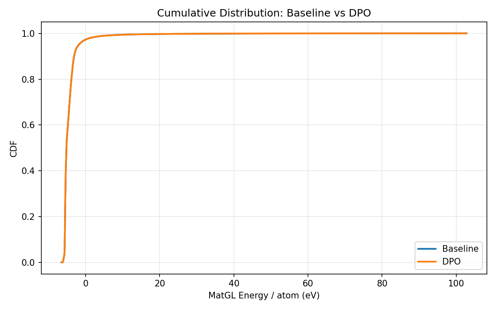
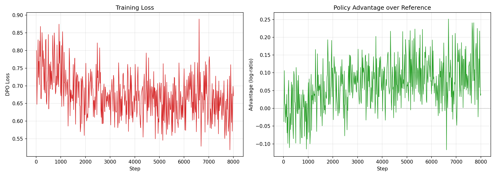

# DPO-CrystaLLM Comparison Report: LiFePO4

## 1. Key Metrics (Done Criteria)

| Metric | Baseline | DPO | Change |
|--------|----------|-----|--------|
| **Validity Rate** | 1.0000 | 1.0000 | +0.0000 |
| **Stability Rate** (Ehull<0.05) | 0.1212 | 0.1214 | +0.0002 |
| **Efficiency** (GPU s/stable) | 0.2s | 13.2s | - |
| **Novelty** | N/A | 1.0000 | N/A |
| Composition Hit Rate | 0.5575 | 0.5582 | +0.0007 |

## 2. MatGL Energy / Atom (eV, lower is better)

| Metric | Baseline | DPO | Change |
|--------|----------|-----|--------|
| Mean | -4.408218 | -4.405549 | +0.002669 |
| Median | -5.171051 | -5.172074 | -0.001023 |
| Std | 3.135087 | 3.121784 | -0.013303 |
| P10 (best 10%) | -5.616938 | -5.618259 | -0.001322 |
| P90 | -3.104878 | -3.105043 | -0.000166 |
| Best | -6.525834 | -6.525834 | +0.000000 |
| Worst | 102.763297 | 102.763297 | +0.000000 |

## 3. Visualizations

### Energy Distribution


### Cumulative Distribution


### Training Loss



## 4. Failure Analysis

### DPO Generation

- Requested: 50000
- Successful: 50000
- Valid rate: 1.0
- Failure breakdown:
  - `validation_error_AssertionError`: 15
  - `validation_error_ValueError`: 13
  - `validation_error_ZeroDivisionError`: 7


## 5. Detailed Counts

### Baseline
- Total: 50000
- Valid: 50000 (100.00%)
- Hit target: 27873 (55.75%)
- Scored: 50000

### DPO
- Total: 50000
- Valid: 50000 (100.00%)
- Hit target: 27910 (55.82%)
- Scored: 50000


## 6. Reproducibility

To reproduce this experiment:
```bash
cd experiments/<exp_name>
# Fresh run:
bash run.sh
# Resume from last checkpoint:
RESUME=1 bash run.sh
```
