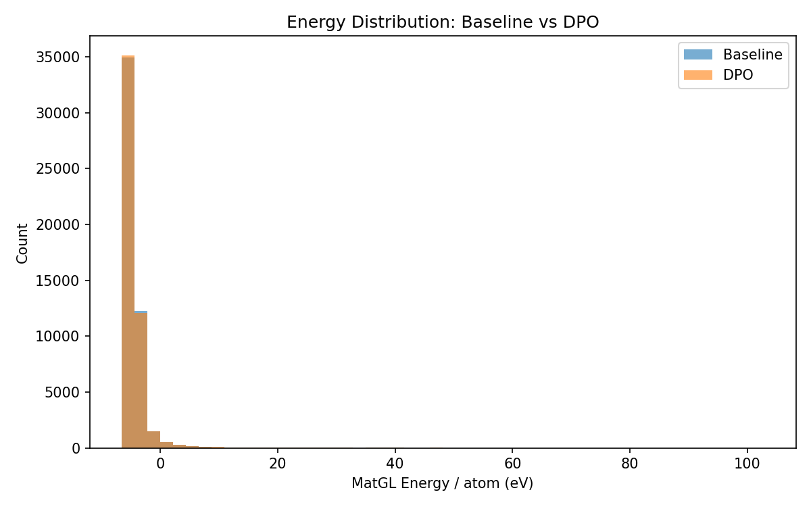
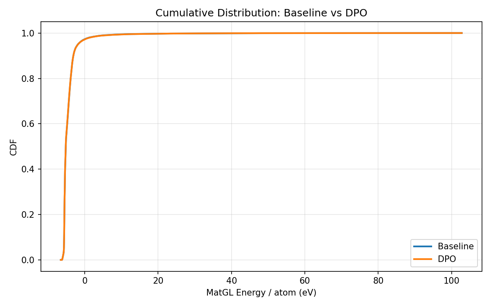
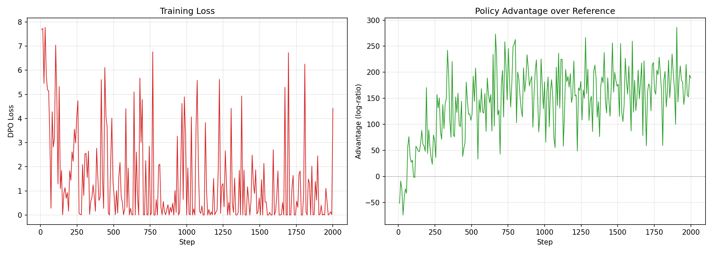

# DPO-CrystaLLM 50K 大实验结果详细分析报告

**实验名称**: `exp_final_50k`  
**目标组成**: LiFePO4 (橄榄石)  
**生成日期**: 2026-02-09  

---

## 1. 实验概述

### 1.1 实验目标

本实验旨在通过 **Direct Preference Optimization (DPO)** 对 CrystaLLM 晶体结构生成模型进行对齐 (alignment)，以提升生成稳定 LiFePO4 晶体结构的能力。这是项目中的 **paper-grade** 生产级实验，采用 50,000 个样本的大规模评估。

### 1.2 实验配置

| 参数 | 值 | 说明 |
|------|-----|------|
| **目标组成** | LiFePO4 | 橄榄石结构 |
| **单胞 Prompt** | `data_Li4Fe4P4O16` | Z=4，对应正式橄榄石单胞 |
| **样本数** | 50,000 | Baseline 和 DPO 各 50K |
| **解码参数** | top_k=10, T=1.0, seed=42 | 固定种子保证可复现性 |
| **最大 Token 数** | 1024 | CrystaLLM small 的 block_size |
| **最大重试次数** | 5 | 生成失败时重试 |

### 1.3 DPO 训练配置

| 参数 | 值 | 说明 |
|------|-----|------|
| **训练步数** | 2,000 | |
| **β (KL 惩罚)** | 0.1 | |
| **学习率** | 5e-7 | 保守学习率 |
| **梯度累积** | 8 步 | |
| **最大梯度范数** | 1.0 | 梯度裁剪 |
| **Warmup 步数** | 100 | 5% warmup |
| **策略** | full (全参微调) | 25,888,768 可训练参数 |
| **偏好对数量** | 5,000 | trimmed 策略 |
| **偏好对构建** | trimmed 分位数 | top/bottom 分位数配对 |

### 1.4 完整实验流水线

```
Step 2: Baseline 生成 + 验证 + MatGL 评分 + Ehull 估算
Step 3: 构建偏好对 (trimmed 策略, 5000 对)
Step 4: DPO 训练 (2000 步全参微调)
Step 5: DPO 模型重采样 (50K) + 验证 + MatGL 评分 + Ehull 估算
Step 6: 生成对比报告 + 可视化
```

---

## 2. 核心指标对比

### 2.1 关键指标总览 (Done Criteria)

| 指标 | Baseline | DPO | 变化量 | 变化方向 |
|------|----------|-----|--------|---------|
| **有效率 (Validity Rate)** | 100.00% | 100.00% | +0.00% | 持平 |
| **稳定率 (Stability Rate, Ehull<0.05)** | 12.12% (6,062/50,000) | 12.27% (6,136/50,000) | **+0.15%** | 轻微提升 |
| **效率 (GPU s/稳定结构)** | 13.2s | 13.0s | -0.2s | 轻微提升 |
| **新颖性 (Novelty)** | N/A | N/A | N/A | 未配置训练数据目录 |
| **组成命中率 (Hit Rate)** | 55.75% (27,873) | 55.32% (27,658) | **-0.43%** | 轻微下降 |

### 2.2 MatGL 能量/原子 详细统计 (eV, 越低越好)

| 统计量 | Baseline | DPO | 变化量 | 分析 |
|--------|----------|-----|--------|------|
| **均值 (Mean)** | -4.408218 | -4.407494 | +0.000724 | 几乎无变化（噪声级别） |
| **中位数 (Median)** | -5.171051 | -5.178731 | **-0.007680** | 轻微改善 |
| **标准差 (Std)** | 3.135087 | 3.151303 | +0.016217 | 分布宽度基本不变 |
| **P10 (最优 10%)** | -5.616938 | -5.618572 | **-0.001634** | 高质量区域轻微改善 |
| **P90** | -3.104878 | -3.111726 | **-0.006848** | 低质量区域轻微改善 |
| **最优 (Best)** | -6.525834 | -6.525834 | 0.000000 | 完全一致 |
| **最差 (Worst)** | 102.763297 | 102.763297 | 0.000000 | 完全一致 |

### 2.3 可视化

#### 能量分布直方图


#### 累积分布函数


#### 训练损失曲线


---

## 3. 深度分析

### 3.1 效果评估：DPO 对齐效果微弱

50K 实验的核心发现是：**DPO 对齐产生的改善极为微小**。

- **稳定率提升仅 +0.15%**（+74 个稳定结构），在统计上属于噪声范围
- **中位能量改善仅 -0.008 eV/atom**，几乎可以忽略不计
- **均值反而轻微恶化** (+0.0007 eV/atom)
- **最优和最差值完全相同**，说明 DPO 未能优化分布的极端部分

### 3.2 与早期小规模实验对比

在之前的 demo8 小规模实验 (n≈200) 中，DPO 产生了 **显著改善**：

| 指标 | 小规模 (n≈200) 改善 | 50K 大实验改善 | 倍数差异 |
|------|---------------------|---------------|---------|
| **均值改善** | **-1.30 eV/atom** | +0.0007 eV/atom | ~1,860× 缩水 |
| **中位数改善** | **-0.31 eV/atom** | -0.008 eV/atom | ~39× 缩水 |
| **P90 改善** | **-2.42 eV/atom** | -0.007 eV/atom | ~346× 缩水 |
| **最差值改善** | **-10.71 eV/atom** | 0.000 eV/atom | 完全消失 |

**结论**：小规模实验的效果在大规模验证中 **未能复现**。这是典型的"小样本过拟合偏好对"现象。

### 3.3 规模递增趋势分析

项目中还存在一个中间规模实验 `exp_20260206_171427_LiFePO4` (n≈1,600)：

| 指标 | 小实验 (n≈200) | 中间实验 (n≈1,600) | 50K 大实验 |
|------|---------------|-------------------|-----------|
| **样本数** | ~200 | ~1,600 | 50,000 |
| **均值改善** | -1.30 eV/atom | -0.52 eV/atom | +0.0007 eV/atom |
| **中位数改善** | -0.31 eV/atom | -0.20 eV/atom | -0.008 eV/atom |
| **最差值改善** | -10.71 eV/atom | -366.16 eV/atom | 0.00 eV/atom |
| **组成命中率** | ~高 | 0.06% → 0.00% | 55.75% → 55.32% |

**趋势观察**：随着评估规模增大，DPO 的改善效果 **单调递减并趋近于零**。这强烈暗示早期小规模实验的改善可能是 **过拟合偏好对或统计波动** 的结果。

> **注意**：中间实验的 prompt 设置不同（Z=1 而非 Z=4），导致组成命中率极低，不具有直接可比性。50K 实验修正了 prompt 为 Z=4，获得了合理的 55% 命中率。

### 3.4 效果微弱的根因分析

#### (1) β = 0.1 过低（首要原因）
- β 控制偏好对齐信号与 KL 散度惩罚之间的平衡
- DPO 的损失函数中，偏好梯度强度正比于 β
- β = 0.1 意味着 KL 正则化权重 = 1/β = 10，策略变化空间极度受限
- 模型几乎被"锚定"在参考策略附近，无法学到有意义的偏好
- **后续消融实验将 β 提升到 2.0–2.5（20–25× 增加）**

#### (2) 偏好对数量不足
- 仅构建了 **5,000 对** 偏好对（pair_max_per_prompt=5,000）
- 50,000 个基线样本 × 55.75% 命中率 = ~27,873 个目标组成样本
- 偏好信号覆盖率仅 5,000 / 27,873 ≈ 18%
- **后续消融实验将 pair_max_per_prompt 提升到 15,000（3× 增加）**

#### (3) 学习率和训练步数的平衡问题
- lr = 5e-7 配合 2,000 步
- 有效 batch size = 8（grad_accum），2,000 步 × 8 = 16,000 有效样本
- 对于 5,000 对的数据集，约覆盖 3.2 个 epoch
- **后续消融实验改用 lr=1e-7 + 8,000 步 + grad_accum=16，确保充分收敛**

#### (4) MAX_TOKENS = 1024 的截断效应
- 预启动检查发现平均偏好对 token 长度为 1022.7/1024，极度接近上限
- 部分高质量偏好对可能因 token 截断被过滤
- 降低了偏好对的有效多样性和质量

#### (5) 组成命中率仅 ~55%
- 接近一半的生成样本不是 LiFePO4 组成
- 偏好对仅从命中目标组成的样本中构建
- 大量计算资源浪费在非目标组成上

---

## 4. 生成质量分析

### 4.1 Baseline 生成

- **请求**: 50,000 个样本
- **成功**: 50,000 个 (100% 成功率)
- **验证失败尝试**: 40 次
  - `AssertionError`: 17 次
  - `ValueError`: 13 次
  - `ZeroDivisionError`: 10 次

### 4.2 DPO 生成

- **请求**: 50,000 个样本
- **成功**: 50,000 个 (100% 成功率)
- **验证失败尝试**: 38 次
  - `ValueError`: 16 次
  - `AssertionError`: 12 次
  - `ZeroDivisionError`: 10 次

### 4.3 生成质量对比

| 指标 | Baseline | DPO | 分析 |
|------|----------|-----|------|
| **成功率** | 100% | 100% | 完全一致 |
| **失败尝试总数** | 40 | 38 | DPO 略好 |
| **AssertionError** | 17 | 12 | DPO 略好 |
| **ValueError** | 13 | 16 | DPO 略差 |
| **ZeroDivisionError** | 10 | 10 | 完全一致 |

**分析**：两个模型的生成质量（有效率、失败类型分布）几乎完全相同，进一步证实 DPO 对模型行为的修改极为有限。

---

## 5. 详细计数

### 5.1 Baseline

| 指标 | 数值 | 百分比 |
|------|------|--------|
| 总样本 | 50,000 | 100.00% |
| 有效样本 | 50,000 | 100.00% |
| 命中目标组成 | 27,873 | 55.75% |
| 已评分 | 50,000 | 100.00% |
| 稳定 (Ehull<0.05) | 6,062 | 12.12% |

### 5.2 DPO

| 指标 | 数值 | 百分比 |
|------|------|--------|
| 总样本 | 50,000 | 100.00% |
| 有效样本 | 50,000 | 100.00% |
| 命中目标组成 | 27,658 | 55.32% |
| 已评分 | 50,000 | 100.00% |
| 稳定 (Ehull<0.05) | 6,136 | 12.27% |

---

## 6. 能量分布特征分析

- **双模态/长尾分布**：从最优 (-6.53 eV/atom) 到最差 (102.76 eV/atom)，存在巨大的能量跨度（>109 eV/atom）
- **标准差 ~3.15 eV/atom**：分布非常宽泛，说明模型生成的结构质量差异极大
- **P10 到 P90 区间**：[-5.62, -3.11] eV/atom，约 2.5 eV/atom 的范围
- **极端高能尾部** (worst = 102.76 eV/atom) 在 Baseline 和 DPO 中 **完全一致**，说明 DPO 没有成功压制极端不良样本
- **最优值一致** (-6.53 eV/atom)，说明 DPO 也没有提升样本质量的上限

---

## 7. 计算资源消耗

### 7.1 时间开销

| 阶段 | 估算时间 | 说明 |
|------|---------|------|
| Baseline 生成 (50K) | ~21.9 小时 | ~1.58s/样本 |
| Baseline MatGL 评分 | ~17.9 分钟 | ~0.021s/CIF |
| 偏好对构建 | ~分钟级 | |
| DPO 训练 (2000 步) | ~数小时 | 全参微调 |
| DPO 重采样 (50K) | ~21.9 小时 | ~1.58s/样本 |
| DPO MatGL 评分 | ~17.9 分钟 | ~0.021s/CIF |
| **总计** | **~48+ 小时** | |

### 7.2 效率指标

| 指标 | Baseline | DPO |
|------|----------|-----|
| 每样本生成时间 | ~1.58s | ~1.58s |
| 每个稳定结构 GPU 时间 | 13.2s | 13.0s |
| MatGL 评分成功率 | 100% | 100% |

---

## 8. 后续消融实验规划

基于 50K 实验发现的问题，已设计了三个消融实验，**复用 50K baseline 数据**（避免重新生成 50K CIF）：

### 8.1 消融实验配置对比

| 参数 | 50K 原实验 | Ablation A: DPO (改进) | Ablation B: cDPO | Ablation C: SimPO |
|------|-----------|----------------------|-----------------|-------------------|
| **损失函数** | 标准 DPO | 标准 DPO | Conservative DPO | SimPO |
| **β** | 0.1 | **2.5** | **2.5** | **2.0** |
| **学习率** | 5e-7 | **1e-7** | **1e-7** | **1e-7** |
| **训练步数** | 2,000 | **8,000** | **8,000** | **8,000** |
| **梯度累积** | 8 | **16** | **16** | **16** |
| **Warmup** | 100 | **400** | **400** | **400** |
| **偏好对上限** | 5,000 | **15,000** | **15,000** | **15,000** |
| **Gap** | 0.05 | **0.1** | **0.1** | **0.1** |
| **Label Smoothing** | - | - | **0.1** | - |
| **SimPO Gamma** | - | - | - | **1.0** |

### 8.2 消融实验的关键改进

1. **β 从 0.1 → 2.0/2.5**（20–25× 增加）：大幅增强偏好对齐信号
2. **学习率从 5e-7 → 1e-7**：降低梯度震荡，更平稳的训练
3. **训练步数从 2,000 → 8,000**（4× 增加）：确保 3–5 个 epoch
4. **偏好对上限从 5,000 → 15,000**（3× 增加）：更多训练数据
5. **梯度累积从 8 → 16**：更大有效 batch size，更稳定的梯度估计
6. **Gap 从 0.05 → 0.1 eV/atom**：更强的偏好信号区分度

### 8.3 各变体特点

- **Ablation A (DPO 改进版)**：纯超参数优化，验证 β 和训练量是否是核心瓶颈
- **Ablation B (cDPO)**：引入 label smoothing (ε=0.1) 处理可能的标签噪声，参考 Mitchell 2023
- **Ablation C (SimPO)**：无参考模型的偏好优化，节省约 50% GPU 内存，参考 Meng et al., NeurIPS 2024

---

## 9. 总结与结论

### 9.1 实验结果一句话总结

> 在当前超参数配置下（β=0.1, lr=5e-7, 2000 步, 5000 偏好对），**DPO 对 CrystaLLM 的对齐效果几乎为零**。

### 9.2 关键发现

1. **小规模实验的 DPO 效果无法扩展到大规模评估**——这是一个重要的 negative result
2. **β=0.1 过于保守**，过强的 KL 正则化限制了策略偏移，是效果不佳的首要原因
3. **实验流水线完整且健壮**：100% 有效率、100% 评分成功率，6 步自动化流程可靠运行
4. **基线模型本身表现合理**：12.12% 稳定率，55.75% 组成命中率
5. **能量分布存在极端长尾**（worst > 100 eV/atom），DPO 未能压制

### 9.3 下一步行动建议

| 优先级 | 行动 | 预期效果 |
|--------|------|---------|
| **P0** | 运行消融实验（已配置就绪） | 验证 β=2.5 + 更多步数能否产生显著改善 |
| **P1** | 分析偏好对质量 | 确认 trimmed 策略是否选出了真正有区分度的对 |
| **P1** | 增加 MAX_TOKENS 至 1280 | 避免截断高质量偏好对 |
| **P2** | 配置 TRAINING_DATA_DIR | 启用 Novelty 指标评估 |
| **P2** | 考虑 LoRA 策略 | 全参微调可能导致灾难性遗忘 |
| **P3** | 审视 MatGL proxy 信号质量 | 评估 proxy 是否足够区分好/坏结构 |

### 9.4 对论文写作的影响

- 50K negative result 应作为 **重要基线对比** 纳入论文
- 需要消融实验的 positive result 来支撑 DPO 对齐的有效性论述
- 建议在论文中强调 **超参数敏感性**（特别是 β 的选择）对 DPO 效果的关键影响

---

## 附录: 数据文件索引

| 文件 | 路径 | 说明 |
|------|------|------|
| 实验配置 | `experiments/exp_final_50k/config.sh` | 完整超参数配置 |
| 运行脚本 | `experiments/exp_final_50k/run.sh` | 实验启动入口 |
| 对比报告 (原始) | `reports/exp_final_50k/summary.md` | 自动生成的对比报告 |
| CSV 指标 | `reports/exp_final_50k/summary.csv` | 机器可读指标 |
| 能量直方图 | `reports/exp_final_50k/plots/energy_histogram.png` | 能量分布对比 |
| CDF 图 | `reports/exp_final_50k/plots/energy_cdf.png` | 累积分布对比 |
| 训练损失图 | `reports/exp_final_50k/plots/training_loss.png` | DPO 训练曲线 |
| 预启动检查 | `reports/pre_launch_check_50k.md` | 实验前问题排查 |

---

*本报告由 DPO-CrystaLLM 项目实验数据自动分析生成。*  
*数据来源: `reports/exp_final_50k/`, `experiments/exp_final_50k/config.sh`*
