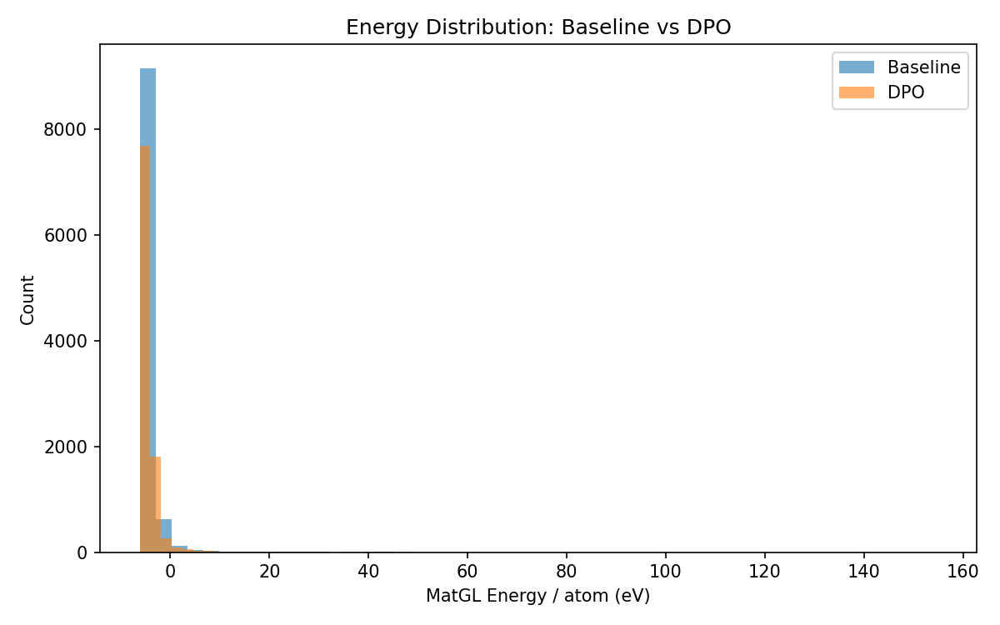
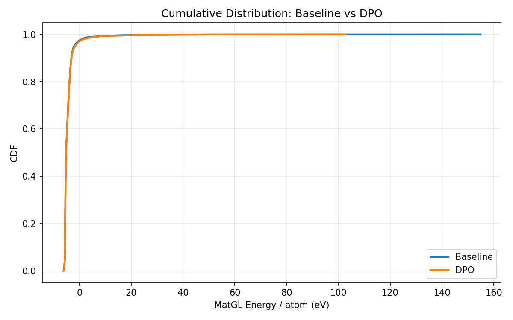
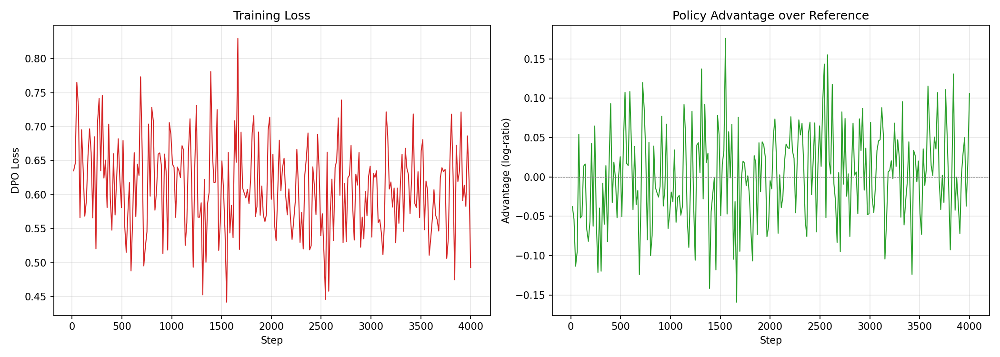

# DPO-CrystaLLM Comparison Report: LiFePO4

## 1. Key Metrics (Done Criteria)

| Metric | Baseline | DPO | Change |
|--------|----------|-----|--------|
| **Validity Rate** | 1.0000 | 1.0000 | +0.0000 |
| **Stability Rate** (Ehull<0.05) | N/A | N/A | N/A |
| **Efficiency** (GPU s/stable) | N/A | N/A | - |
| **Novelty** | N/A | N/A | N/A |
| Composition Hit Rate | 0.5051 | 0.5595 | +0.0544 |

## 2. MatGL Energy / Atom (eV, lower is better)

| Metric | Baseline | DPO | Change |
|--------|----------|-----|--------|
| Mean | -4.462409 | -4.390288 | +0.072122 |
| Median | -5.182902 | -5.170422 | +0.012480 |
| Std | 3.291101 | 3.136865 | -0.154236 |
| P10 (best 10%) | -5.620818 | -5.620944 | -0.000126 |
| P90 | -3.170089 | -3.108574 | +0.061516 |
| Best | -6.213557 | -6.214335 | -0.000778 |
| Worst | 154.792664 | 102.763297 | -52.029367 |

## 3. Visualizations

### Energy Distribution


### Cumulative Distribution


### Training Loss



## 4. Failure Analysis


## 5. Detailed Counts

### Baseline
- Total: 10000
- Valid: 10000 (100.00%)
- Hit target: 5051 (50.51%)
- Scored: 10000

### DPO
- Total: 10000
- Valid: 10000 (100.00%)
- Hit target: 5595 (55.95%)
- Scored: 10000


## 6. Reproducibility

To reproduce this experiment:
```bash
cd experiments/<exp_name>
# Fresh run:
bash run.sh
# Resume from last checkpoint:
RESUME=1 bash run.sh
```
