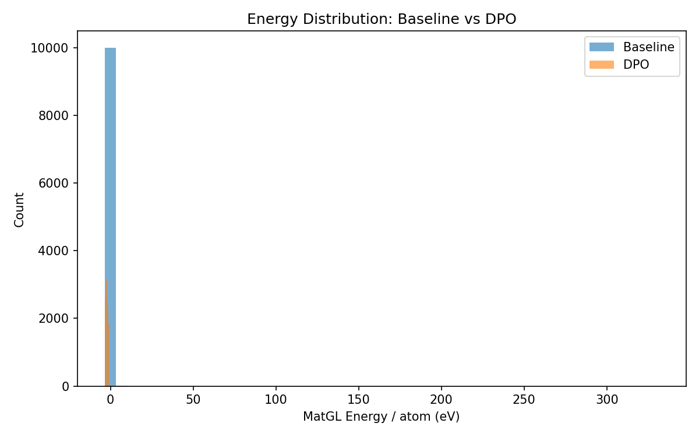
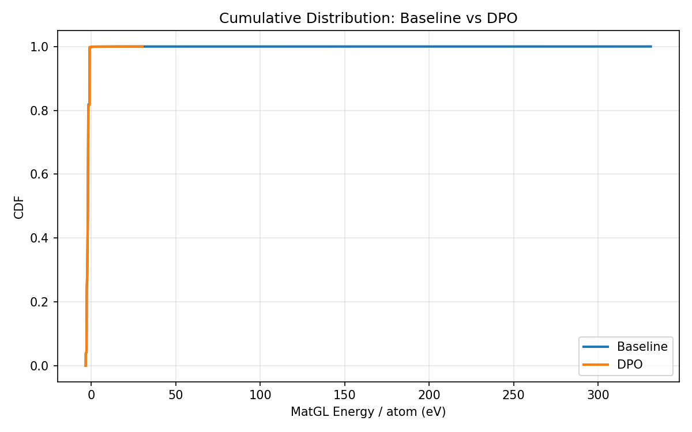

# DPO-CrystaLLM Comparison Report: NaCl

## 1. Key Metrics (Done Criteria)

| Metric | Baseline | DPO | Change |
|--------|----------|-----|--------|
| **Validity Rate** | 1.0000 | 1.0000 | +0.0000 |
| **Stability Rate** (Ehull<0.05) | N/A | N/A | N/A |
| **Efficiency** (GPU s/stable) | N/A | N/A | - |
| **Novelty** | N/A | N/A | N/A |
| Composition Hit Rate | 0.8868 | 0.8865 | -0.0003 |

## 2. MatGL Energy / Atom (eV, lower is better)

| Metric | Baseline | DPO | Change |
|--------|----------|-----|--------|
| Mean | -1.942050 | -1.982195 | -0.040145 |
| Median | -1.927953 | -1.930714 | -0.002761 |
| Std | 3.409741 | 0.757294 | -2.652446 |
| P10 (best 10%) | -2.680047 | -2.681292 | -0.001246 |
| P90 | -0.966980 | -0.966969 | +0.000012 |
| Best | -3.242089 | -3.235106 | +0.006983 |
| Worst | 331.072662 | 30.285370 | -300.787292 |

## 3. Visualizations

### Energy Distribution


### Cumulative Distribution


### Training Loss


## 4. Failure Analysis


## 5. Detailed Counts

### Baseline
- Total: 10000
- Valid: 10000 (100.00%)
- Hit target: 8868 (88.68%)
- Scored: 10000

### DPO
- Total: 10000
- Valid: 10000 (100.00%)
- Hit target: 8865 (88.65%)
- Scored: 10000


## 6. Reproducibility

To reproduce this experiment:
```bash
cd experiments/<exp_name>
# Fresh run:
bash run.sh
# Resume from last checkpoint:
RESUME=1 bash run.sh
```
