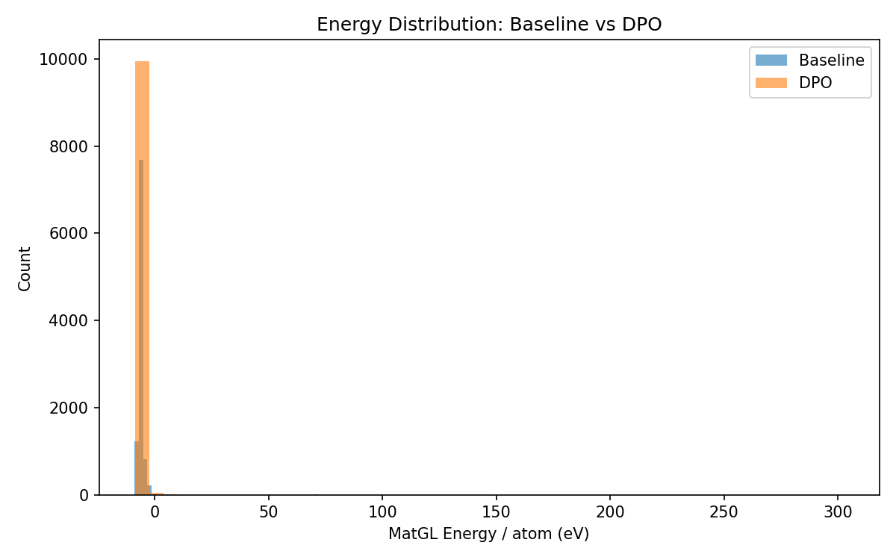
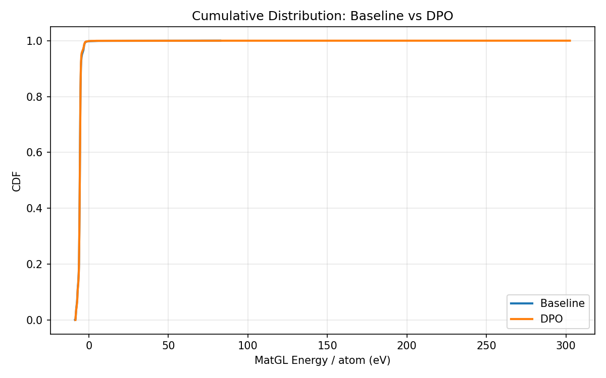

# DPO-CrystaLLM Comparison Report: TiO2

## 1. Key Metrics (Done Criteria)

| Metric | Baseline | DPO | Change |
|--------|----------|-----|--------|
| **Validity Rate** | 1.0000 | 1.0000 | +0.0000 |
| **Stability Rate** (Ehull<0.05) | N/A | N/A | N/A |
| **Efficiency** (GPU s/stable) | N/A | N/A | - |
| **Novelty** | N/A | N/A | N/A |
| Composition Hit Rate | 0.4519 | 0.4463 | -0.0056 |

## 2. MatGL Energy / Atom (eV, lower is better)

| Metric | Baseline | DPO | Change |
|--------|----------|-----|--------|
| Mean | -5.727930 | -5.723531 | +0.004399 |
| Median | -5.701498 | -5.688162 | +0.013336 |
| Std | 2.016645 | 3.505512 | +1.488867 |
| P10 (best 10%) | -7.123427 | -7.069831 | +0.053596 |
| P90 | -5.002877 | -5.039477 | -0.036600 |
| Best | -8.680105 | -8.456523 | +0.223582 |
| Worst | 82.611122 | 302.487274 | +219.876152 |

## 3. Visualizations

### Energy Distribution


### Cumulative Distribution


### Training Loss


## 4. Failure Analysis


## 5. Detailed Counts

### Baseline
- Total: 10000
- Valid: 10000 (100.00%)
- Hit target: 4519 (45.19%)
- Scored: 10000

### DPO
- Total: 10000
- Valid: 10000 (100.00%)
- Hit target: 4463 (44.63%)
- Scored: 10000


## 6. Reproducibility

To reproduce this experiment:
```bash
cd experiments/<exp_name>
# Fresh run:
bash run.sh
# Resume from last checkpoint:
RESUME=1 bash run.sh
```
