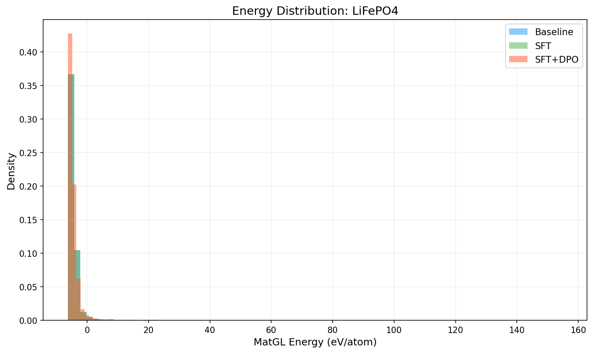
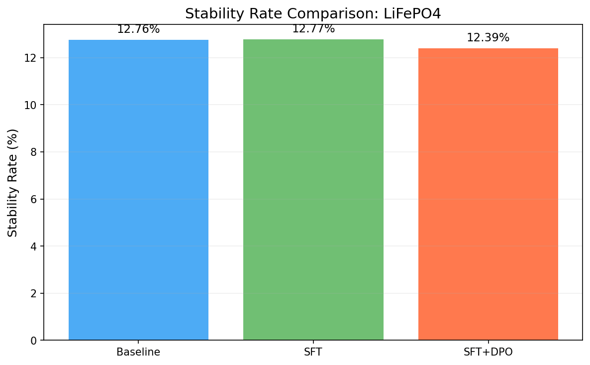
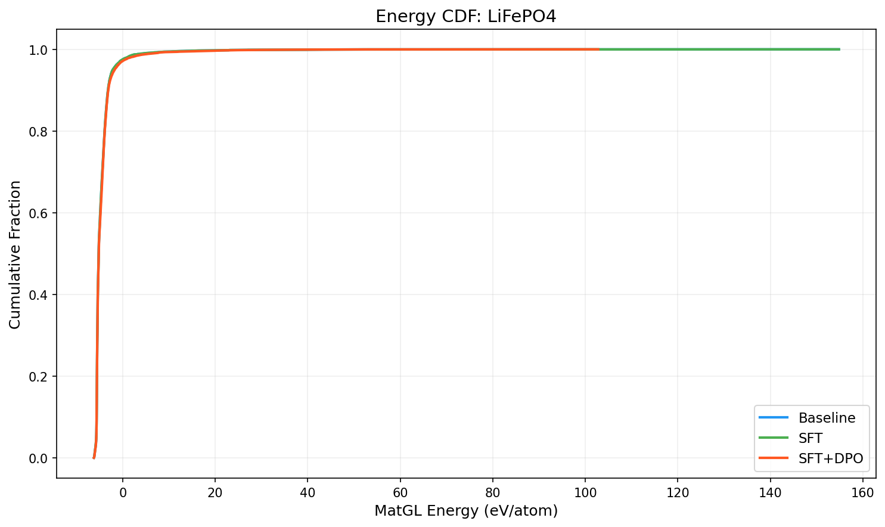

# Three-Way Comparison Report: LiFePO4

**Models**: Baseline vs SFT vs SFT+DPO

## 1. Key Metrics

| Metric | Baseline | SFT | SFT+DPO | SFT vs Base | SFT+DPO vs Base |
|--------|----------|-----|---------|-------------|----------------|
| Validity Rate | 1.0000 | 1.0000 | 1.0000 | +0.0000 | +0.0000 |
| **Stability Rate** | 0.1276 | 0.1277 | **0.1239** | +0.0001 | -0.0037 |
| Stable Count | 1276 | 1277 | 1239 | +1 | -37 |
| Composition Hit Rate | 0.5051 | 0.5052 | 0.5595 | +0.0001 | +0.0544 |

## 2. MatGL Energy Distribution (eV/atom, lower is better)

| Metric | Baseline | SFT | SFT+DPO | SFT vs Base | SFT+DPO vs Base |
|--------|----------|-----|---------|-------------|----------------|
| Mean | -4.4624 | -4.4644 | -4.3903 | -0.0020 | +0.0721 |
| Median | -5.1829 | -5.1823 | -5.1704 | +0.0006 | +0.0125 |
| Std | 3.2911 | 3.2848 | 3.1369 | -0.0063 | -0.1542 |

**Baseline**: P10=-5.6208, P90=-3.1701, Best=-6.2136, Worst=154.7927
**SFT**: P10=-5.6208, P90=-3.1612, Best=-6.2136, Worst=154.7927
**SFT+DPO**: P10=-5.6209, P90=-3.1086, Best=-6.2143, Worst=102.7633

## 3. Composite Reward

| Metric | Baseline | SFT | SFT+DPO |
|--------|----------|-----|--------|
| R_energy | 0.8105 | 0.8098 | N/A |
| R_structure | 0.9998 | 0.9998 | N/A |
| R_difficulty | 0.88 | 0.88 | N/A |
| R_composition | 0.7524 | 0.7524 | N/A |

## 4. Visualizations

## 5. Interpretation

SFT+DPO does not improve stability rate over baseline (delta=-0.37%). Consider tuning hyperparameters or increasing training data.

SFT alone contributes 0.01% improvement, suggesting the space-group distribution shift is effective.

