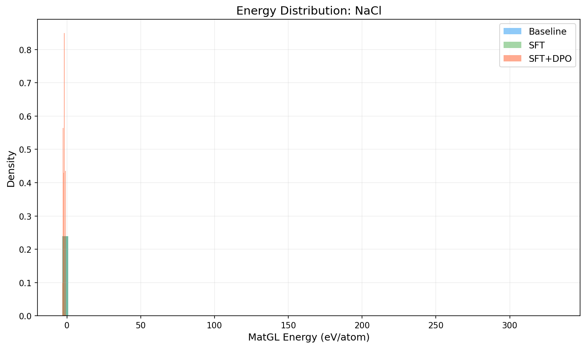
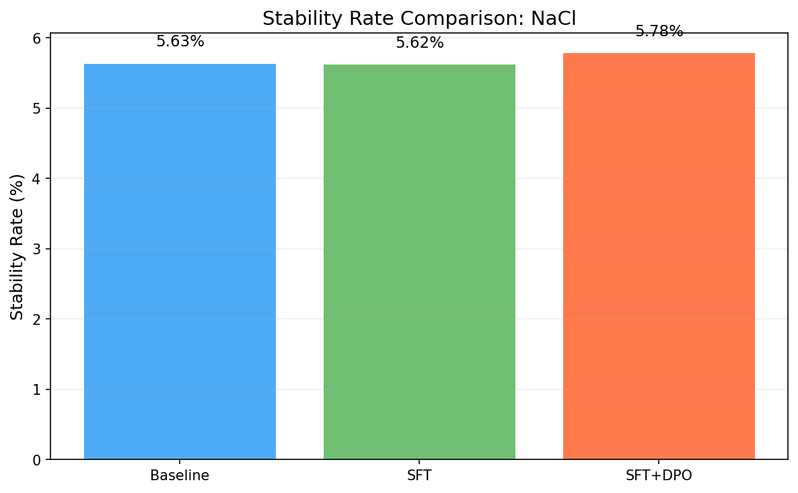
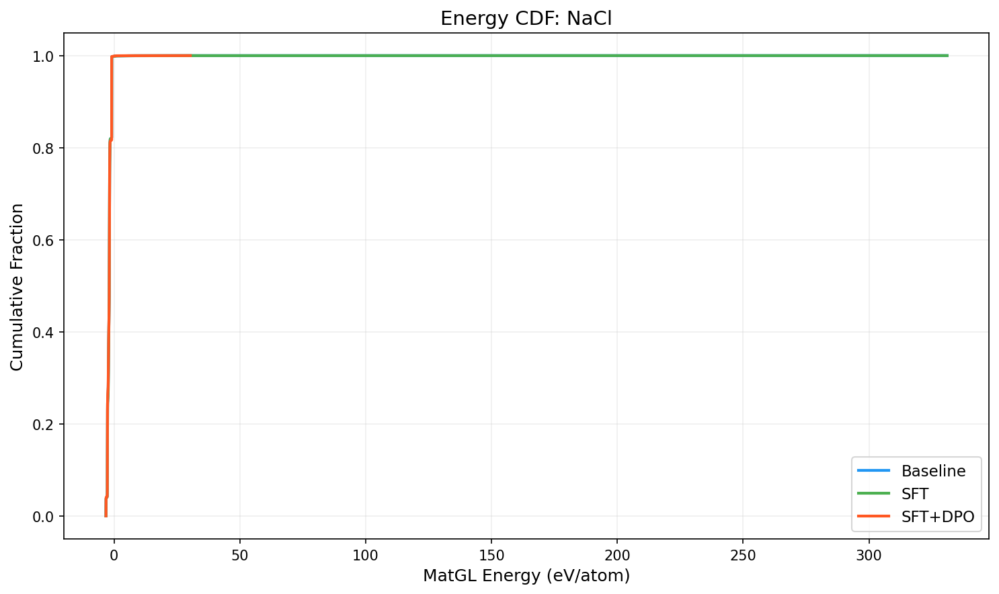

# Three-Way Comparison Report: NaCl

**Models**: Baseline vs SFT vs SFT+DPO

## 1. Key Metrics

| Metric | Baseline | SFT | SFT+DPO | SFT vs Base | SFT+DPO vs Base |
|--------|----------|-----|---------|-------------|----------------|
| Validity Rate | 1.0000 | 1.0000 | 1.0000 | +0.0000 | +0.0000 |
| **Stability Rate** | 0.0563 | 0.0562 | **0.0578** | -0.0001 | +0.0015 |
| Stable Count | 563 | 562 | 578 | -1 | +15 |
| Composition Hit Rate | 0.8868 | 0.8868 | 0.8865 | +0.0000 | -0.0003 |

## 2. MatGL Energy Distribution (eV/atom, lower is better)

| Metric | Baseline | SFT | SFT+DPO | SFT vs Base | SFT+DPO vs Base |
|--------|----------|-----|---------|-------------|----------------|
| Mean | -1.9420 | -1.9418 | -1.9822 | +0.0002 | -0.0401 |
| Median | -1.9280 | -1.9278 | -1.9307 | +0.0002 | -0.0028 |
| Std | 3.4097 | 3.4097 | 0.7573 | -0.0000 | -2.6524 |

**Baseline**: P10=-2.6800, P90=-0.9670, Best=-3.2421, Worst=331.0727
**SFT**: P10=-2.6800, P90=-0.9670, Best=-3.2421, Worst=331.0727
**SFT+DPO**: P10=-2.6813, P90=-0.9670, Best=-3.2351, Worst=30.2854

## 3. Composite Reward

| Metric | Baseline | SFT | SFT+DPO |
|--------|----------|-----|--------|
| R_energy | 0.4509 | 0.4508 | N/A |
| R_structure | 0.9738 | 0.9738 | N/A |
| R_difficulty | 0.88 | 0.88 | N/A |
| R_composition | 0.9434 | 0.9434 | N/A |

## 4. Visualizations

## 5. Interpretation

SFT+DPO shows a marginal improvement of **0.15%** in stability rate over baseline. This may be within noise; larger samples are recommended.

