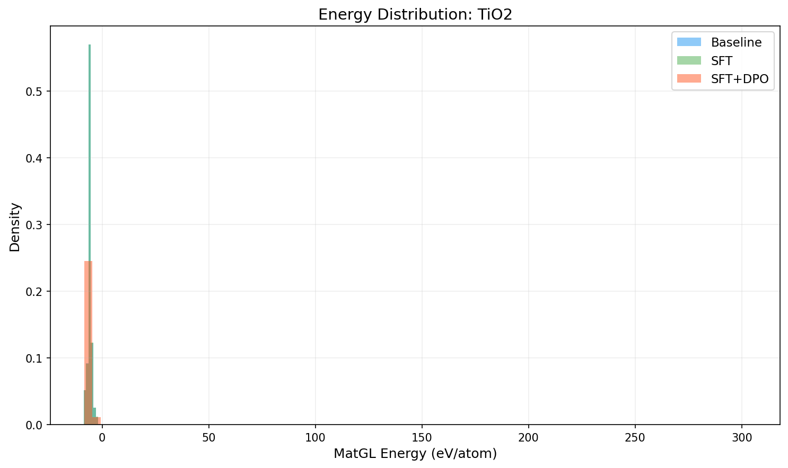
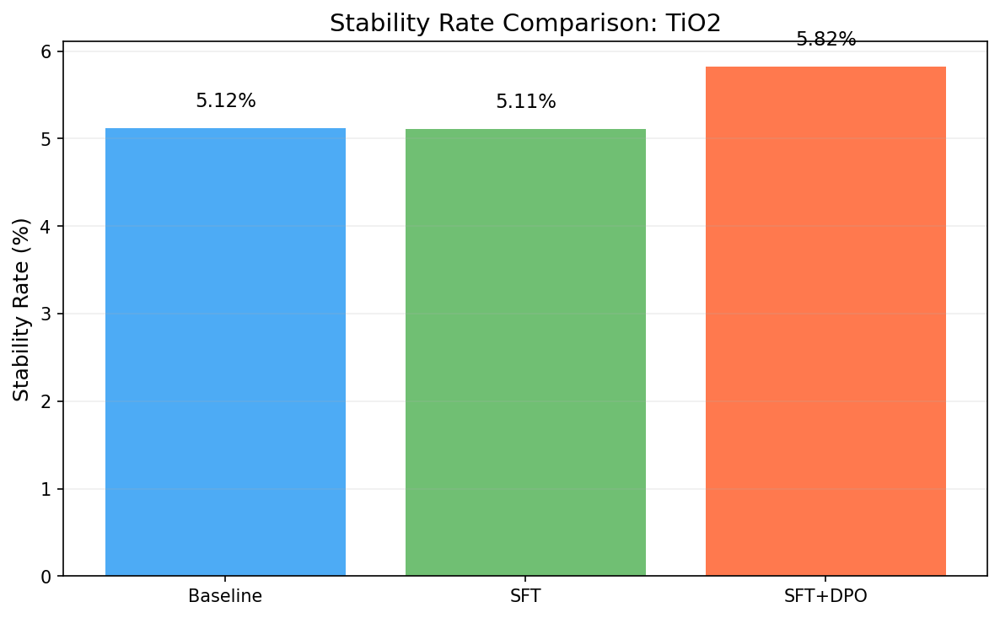
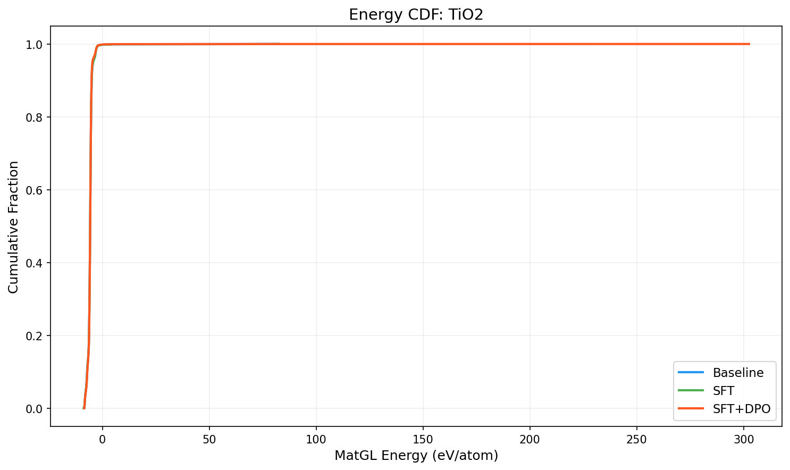

# Three-Way Comparison Report: TiO2

**Models**: Baseline vs SFT vs SFT+DPO

## 1. Key Metrics

| Metric | Baseline | SFT | SFT+DPO | SFT vs Base | SFT+DPO vs Base |
|--------|----------|-----|---------|-------------|----------------|
| Validity Rate | 1.0000 | 1.0000 | 1.0000 | +0.0000 | +0.0000 |
| **Stability Rate** | 0.0512 | 0.0511 | **0.0582** | -0.0001 | +0.0070 |
| Stable Count | 512 | 511 | 582 | -1 | +70 |
| Composition Hit Rate | 0.4519 | 0.4518 | 0.4463 | -0.0001 | -0.0056 |

## 2. MatGL Energy Distribution (eV/atom, lower is better)

| Metric | Baseline | SFT | SFT+DPO | SFT vs Base | SFT+DPO vs Base |
|--------|----------|-----|---------|-------------|----------------|
| Mean | -5.7279 | -5.7269 | -5.7235 | +0.0010 | +0.0044 |
| Median | -5.7015 | -5.7008 | -5.6882 | +0.0007 | +0.0133 |
| Std | 2.0166 | 2.0169 | 3.5055 | +0.0002 | +1.4889 |

**Baseline**: P10=-7.1234, P90=-5.0029, Best=-8.6801, Worst=82.6111
**SFT**: P10=-7.1223, P90=-5.0019, Best=-8.6801, Worst=82.6111
**SFT+DPO**: P10=-7.0698, P90=-5.0395, Best=-8.4565, Worst=302.4873

## 3. Composite Reward

| Metric | Baseline | SFT | SFT+DPO |
|--------|----------|-----|--------|
| R_energy | 0.5306 | 0.531 | N/A |
| R_structure | 0.9998 | 0.9998 | N/A |
| R_difficulty | 0.88 | 0.88 | N/A |
| R_composition | 0.7259 | 0.7259 | N/A |

## 4. Visualizations

## 5. Interpretation

SFT+DPO shows a marginal improvement of **0.70%** in stability rate over baseline. This may be within noise; larger samples are recommended.

