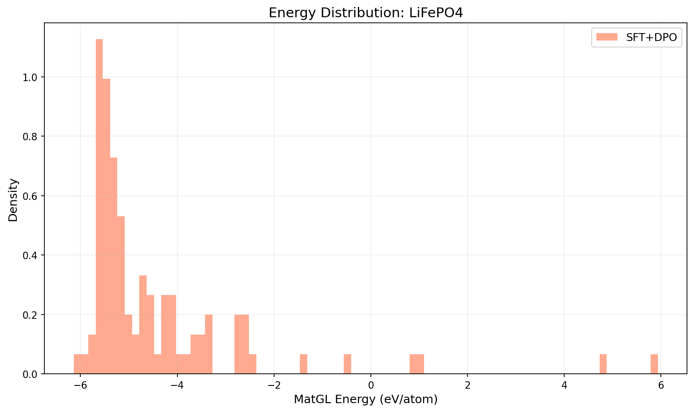
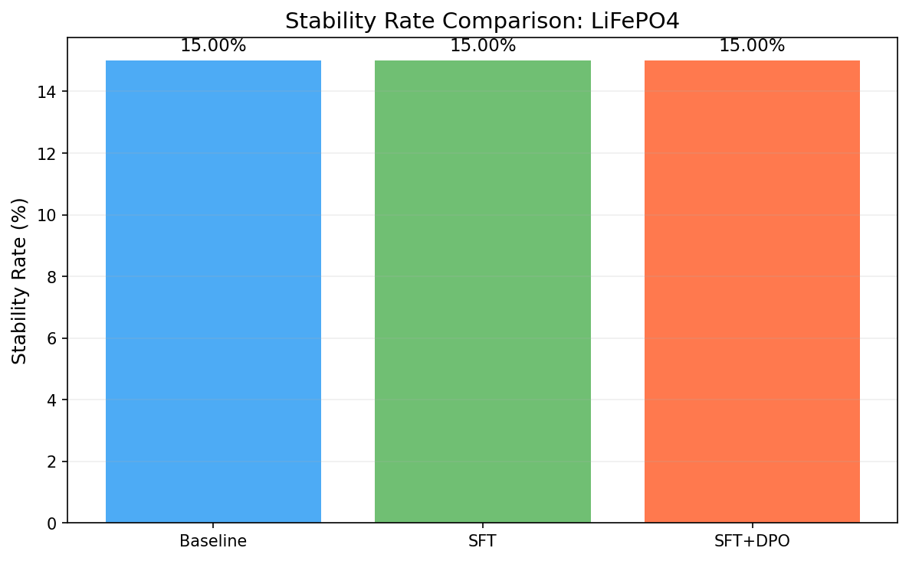
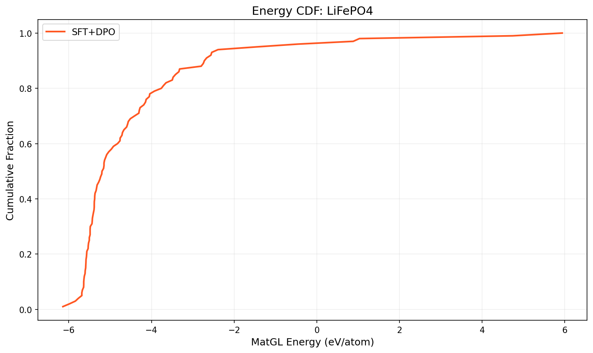

# Three-Way Comparison Report: LiFePO4

**Models**: Baseline vs SFT vs SFT+DPO

## 1. Key Metrics

| Metric | Baseline | SFT | SFT+DPO | SFT vs Base | SFT+DPO vs Base |
|--------|----------|-----|---------|-------------|----------------|
| Validity Rate | 0.0000 | 0.0000 | 1.0000 | +0.0000 | +1.0000 |
| **Stability Rate** | 0.1500 | 0.1500 | **0.1500** | +0.0000 | +0.0000 |
| Stable Count | 15 | 15 | 15 | +0 | +0 |
| Composition Hit Rate | 0.0000 | 0.0000 | 0.5600 | +0.0000 | +0.5600 |

## 2. MatGL Energy Distribution (eV/atom, lower is better)

| Metric | Baseline | SFT | SFT+DPO | SFT vs Base | SFT+DPO vs Base |
|--------|----------|-----|---------|-------------|----------------|
| Mean | N/A | N/A | -4.4575 | N/A | N/A |
| Median | N/A | N/A | -5.1783 | N/A | N/A |
| Std | N/A | N/A | 1.9315 | N/A | N/A |

**SFT+DPO**: P10=-5.6332, P90=-2.6660, Best=-6.1431, Worst=5.9362

## 3. Composite Reward

| Metric | Baseline | SFT | SFT+DPO |
|--------|----------|-----|--------|
| R_energy | 0.7947 | 0.7947 | N/A |
| R_structure | 1.0 | 1.0 | N/A |
| R_difficulty | 0.88 | 0.88 | N/A |
| R_composition | 0.76 | 0.76 | N/A |

## 4. Visualizations

## 5. Interpretation

SFT+DPO does not improve stability rate over baseline (delta=0.00%). Consider tuning hyperparameters or increasing training data.

