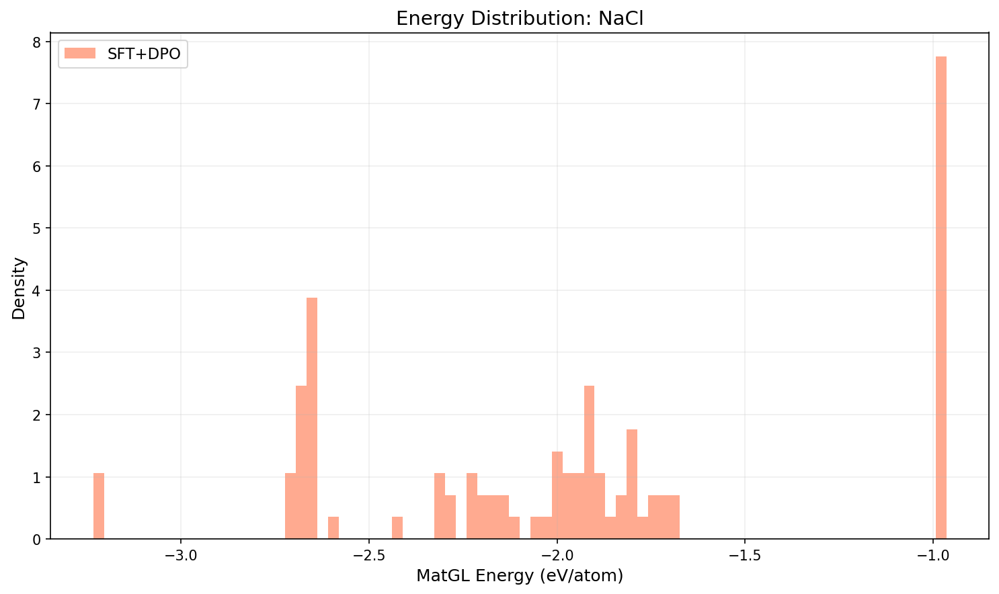
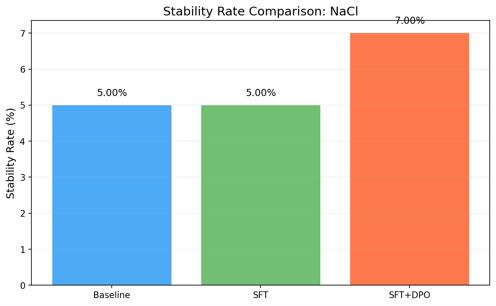
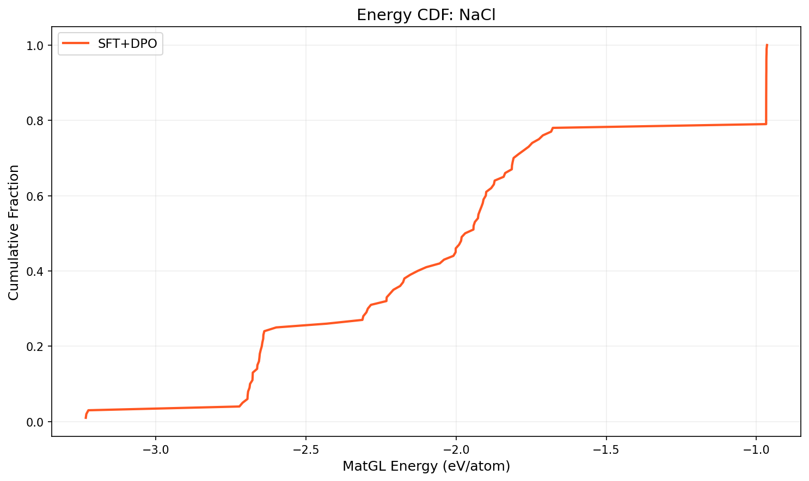

# Three-Way Comparison Report: NaCl

**Models**: Baseline vs SFT vs SFT+DPO

## 1. Key Metrics

| Metric | Baseline | SFT | SFT+DPO | SFT vs Base | SFT+DPO vs Base |
|--------|----------|-----|---------|-------------|----------------|
| Validity Rate | 0.0000 | 0.0000 | 1.0000 | +0.0000 | +1.0000 |
| **Stability Rate** | 0.0500 | 0.0500 | **0.0700** | +0.0000 | +0.0200 |
| Stable Count | 5 | 5 | 7 | +0 | +2 |
| Composition Hit Rate | 0.0000 | 0.0000 | 0.8700 | +0.0000 | +0.8700 |

## 2. MatGL Energy Distribution (eV/atom, lower is better)

| Metric | Baseline | SFT | SFT+DPO | SFT vs Base | SFT+DPO vs Base |
|--------|----------|-----|---------|-------------|----------------|
| Mean | N/A | N/A | -1.9498 | N/A | N/A |
| Median | N/A | N/A | -1.9562 | N/A | N/A |
| Std | N/A | N/A | 0.6314 | N/A | N/A |

**SFT+DPO**: P10=-2.6785, P90=-0.9670, Best=-3.2336, Worst=-0.9645

## 3. Composite Reward

| Metric | Baseline | SFT | SFT+DPO |
|--------|----------|-----|--------|
| R_energy | 0.5855 | 0.5857 | N/A |
| R_structure | 0.982 | 0.982 | N/A |
| R_difficulty | 0.88 | 0.88 | N/A |
| R_composition | 0.94 | 0.94 | N/A |

## 4. Visualizations

## 5. Interpretation

SFT+DPO shows a meaningful improvement of **2.00%** in stability rate over baseline.

