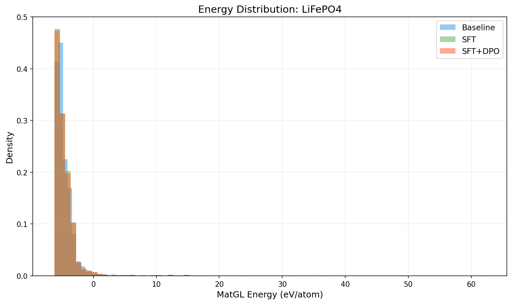
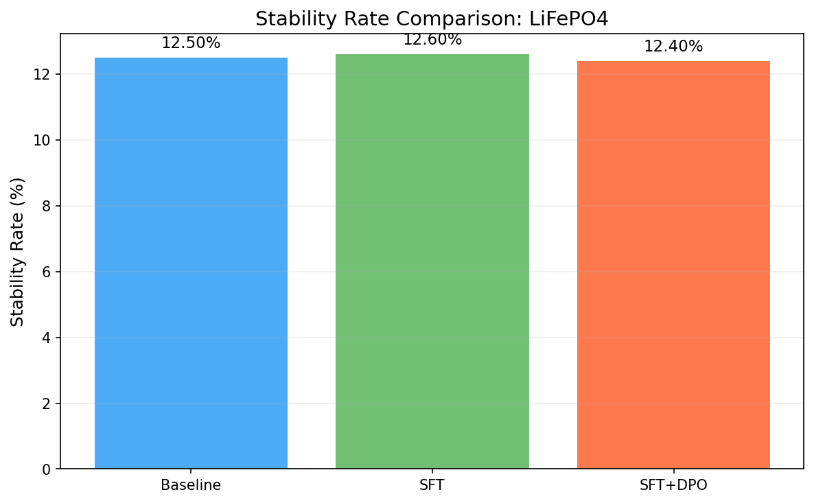
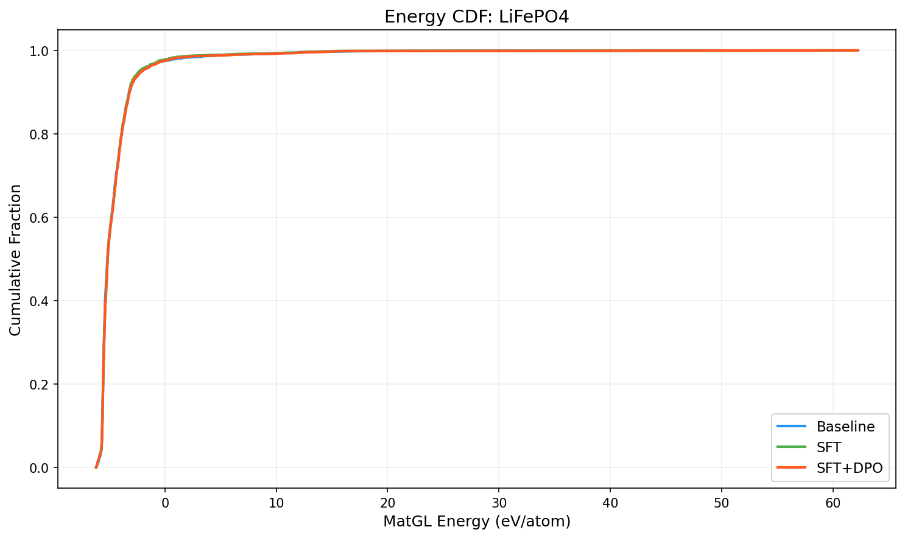

# Three-Way Comparison Report: LiFePO4

**Models**: Baseline vs SFT vs SFT+DPO

## 1. Key Metrics

| Metric | Baseline | SFT | SFT+DPO | SFT vs Base | SFT+DPO vs Base |
|--------|----------|-----|---------|-------------|----------------|
| Validity Rate | 1.0000 | 1.0000 | 1.0000 | +0.0000 | +0.0000 |
| **Stability Rate** | 0.1250 | 0.1260 | **0.1240** | +0.0010 | -0.0010 |
| Stable Count | 250 | 252 | 248 | +2 | -2 |
| Composition Hit Rate | 0.5090 | 0.5255 | 0.5255 | +0.0165 | +0.0165 |

## 2. MatGL Energy Distribution (eV/atom, lower is better)

| Metric | Baseline | SFT | SFT+DPO | SFT vs Base | SFT+DPO vs Base |
|--------|----------|-----|---------|-------------|----------------|
| Mean | -4.4646 | -4.4749 | -4.4333 | -0.0103 | +0.0313 |
| Median | -5.1652 | -5.1474 | -5.1474 | +0.0178 | +0.0178 |
| Std | 2.6218 | 2.8563 | 2.9499 | +0.2346 | +0.3282 |

**Baseline**: P10=-5.6263, P90=-3.1867, Best=-6.1918, Worst=49.5498
**SFT**: P10=-5.6257, P90=-3.2231, Best=-6.1725, Worst=62.2488
**SFT+DPO**: P10=-5.6241, P90=-3.1821, Best=-6.1725, Worst=62.2488

## 3. Composite Reward

| Metric | Baseline | SFT | SFT+DPO |
|--------|----------|-----|--------|
| R_energy | 0.8158 | 0.7955 | 0.7999 |
| R_structure | 0.5 | 0.5 | 0.5 |
| R_difficulty | 0.9999 | 0.0503 | 0.0503 |
| R_composition | 0.7545 | 0.989 | 0.989 |

## 4. Visualizations

## 5. Interpretation

SFT+DPO does not improve stability rate over baseline (delta=-0.10%). Consider tuning hyperparameters or increasing training data.

SFT alone contributes 0.10% improvement, suggesting the space-group distribution shift is effective.

