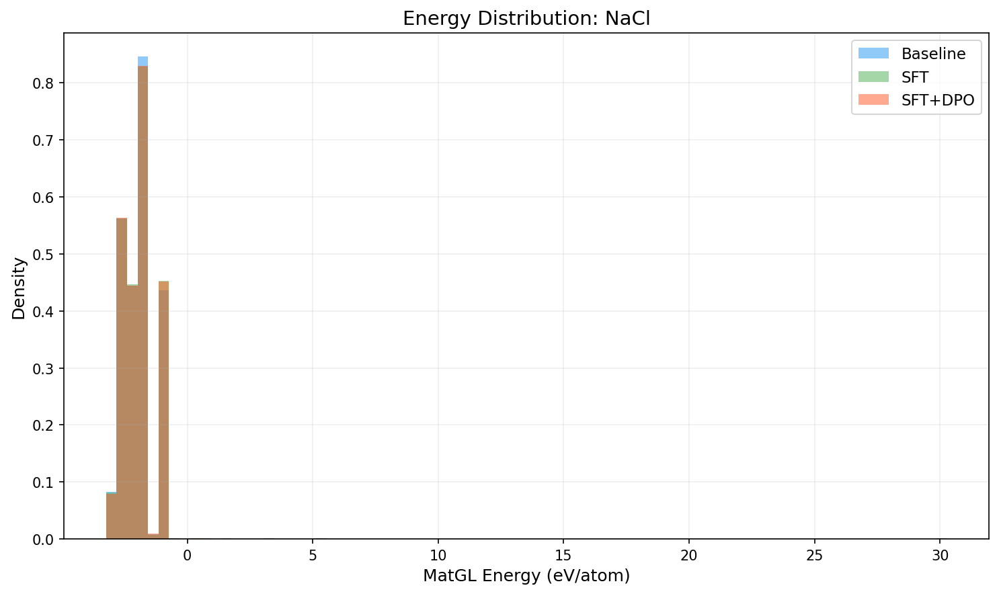
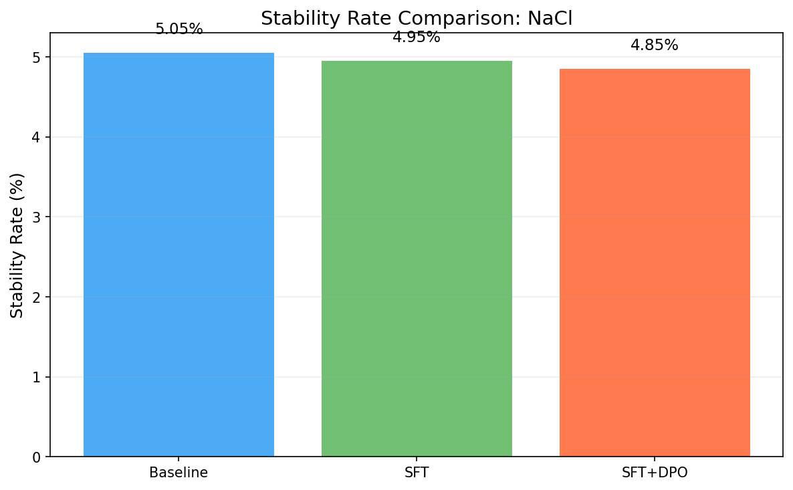
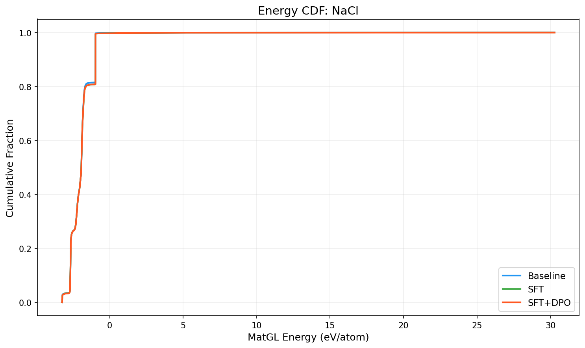

# Three-Way Comparison Report: NaCl

**Models**: Baseline vs SFT vs SFT+DPO

## 1. Key Metrics

| Metric | Baseline | SFT | SFT+DPO | SFT vs Base | SFT+DPO vs Base |
|--------|----------|-----|---------|-------------|----------------|
| Validity Rate | 1.0000 | 1.0000 | 1.0000 | +0.0000 | +0.0000 |
| **Stability Rate** | 0.0505 | 0.0495 | **0.0485** | -0.0010 | -0.0020 |
| Stable Count | 101 | 99 | 97 | -2 | -4 |
| Composition Hit Rate | 0.8865 | 0.8875 | 0.8875 | +0.0010 | +0.0010 |

## 2. MatGL Energy Distribution (eV/atom, lower is better)

| Metric | Baseline | SFT | SFT+DPO | SFT vs Base | SFT+DPO vs Base |
|--------|----------|-----|---------|-------------|----------------|
| Mean | -1.9610 | -1.9521 | -1.9508 | +0.0089 | +0.0102 |
| Median | -1.9303 | -1.9305 | -1.9304 | -0.0002 | -0.0001 |
| Std | 0.9648 | 0.9724 | 0.9715 | +0.0076 | +0.0067 |

**Baseline**: P10=-2.6785, P90=-0.9670, Best=-3.2415, Worst=30.2854
**SFT**: P10=-2.6789, P90=-0.9670, Best=-3.2415, Worst=30.2854
**SFT+DPO**: P10=-2.6785, P90=-0.9669, Best=-3.2415, Worst=30.2854

## 3. Composite Reward

| Metric | Baseline | SFT | SFT+DPO |
|--------|----------|-----|--------|
| R_energy | 0.4504 | 0.4473 | 0.4469 |
| R_structure | 0.5 | 0.5 | 0.5 |
| R_difficulty | 0.6121 | 0.5857 | 0.5855 |
| R_composition | 0.9433 | 0.9942 | 0.9942 |

## 4. Visualizations

## 5. Interpretation

SFT+DPO does not improve stability rate over baseline (delta=-0.20%). Consider tuning hyperparameters or increasing training data.

