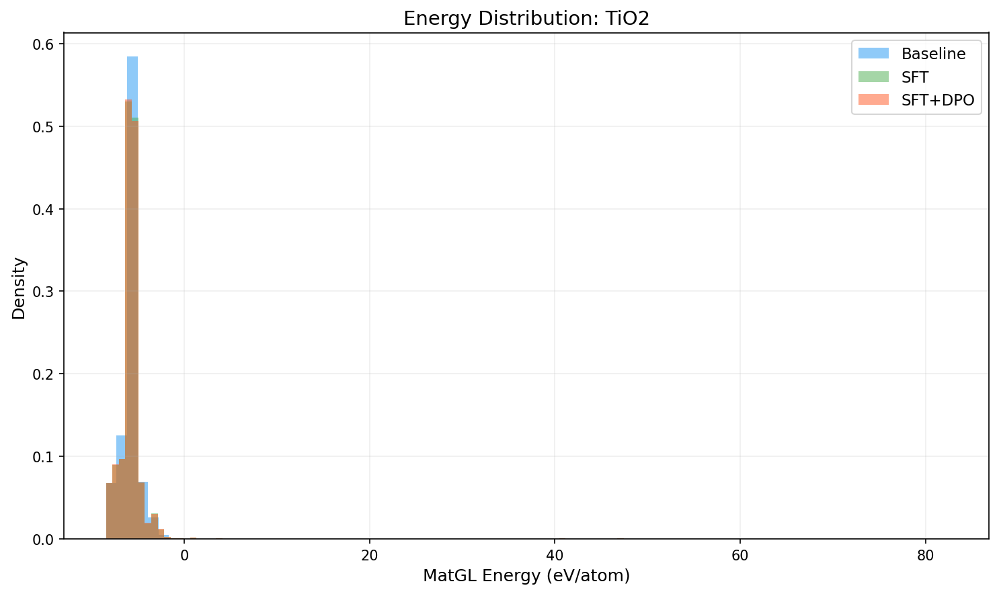
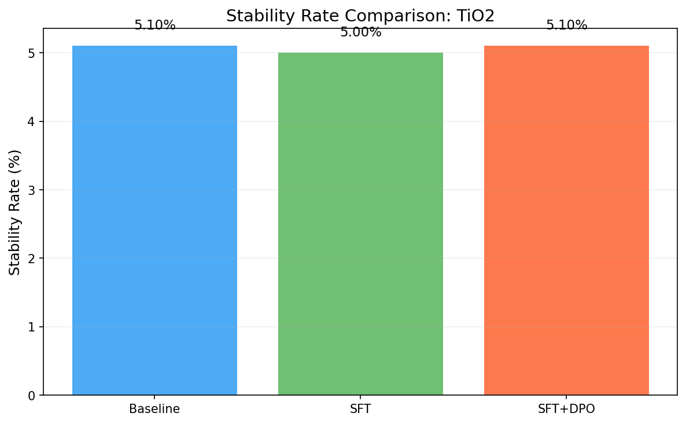
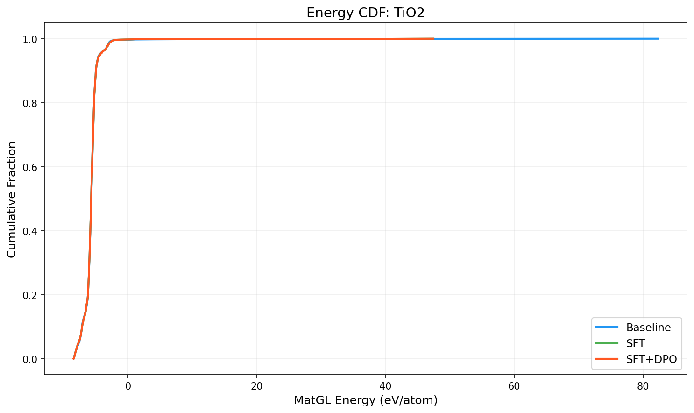

# Three-Way Comparison Report: TiO2

**Models**: Baseline vs SFT vs SFT+DPO

## 1. Key Metrics

| Metric | Baseline | SFT | SFT+DPO | SFT vs Base | SFT+DPO vs Base |
|--------|----------|-----|---------|-------------|----------------|
| Validity Rate | 1.0000 | 1.0000 | 1.0000 | +0.0000 | +0.0000 |
| **Stability Rate** | 0.0510 | 0.0500 | **0.0510** | -0.0010 | +0.0000 |
| Stable Count | 102 | 100 | 102 | -2 | +0 |
| Composition Hit Rate | 0.4580 | 0.4470 | 0.4480 | -0.0110 | -0.0100 |

## 2. MatGL Energy Distribution (eV/atom, lower is better)

| Metric | Baseline | SFT | SFT+DPO | SFT vs Base | SFT+DPO vs Base |
|--------|----------|-----|---------|-------------|----------------|
| Mean | -5.6891 | -5.7308 | -5.7320 | -0.0417 | -0.0430 |
| Median | -5.7182 | -5.7185 | -5.7214 | -0.0003 | -0.0033 |
| Std | 2.6936 | 1.8794 | 1.8802 | -0.8142 | -0.8133 |

**Baseline**: P10=-7.1530, P90=-4.9840, Best=-8.4507, Worst=82.3491
**SFT**: P10=-7.1328, P90=-4.9840, Best=-8.4507, Worst=47.4542
**SFT+DPO**: P10=-7.1362, P90=-4.9819, Best=-8.4507, Worst=47.4542

## 3. Composite Reward

| Metric | Baseline | SFT | SFT+DPO |
|--------|----------|-----|--------|
| R_energy | 0.5279 | 0.5316 | 0.5319 |
| R_structure | 0.5 | 0.5 | 0.5 |
| R_difficulty | 0.7704 | 0.3803 | 0.3802 |
| R_composition | 0.729 | 0.9721 | 0.9721 |

## 4. Visualizations

## 5. Interpretation

SFT+DPO does not improve stability rate over baseline (delta=0.00%). Consider tuning hyperparameters or increasing training data.

