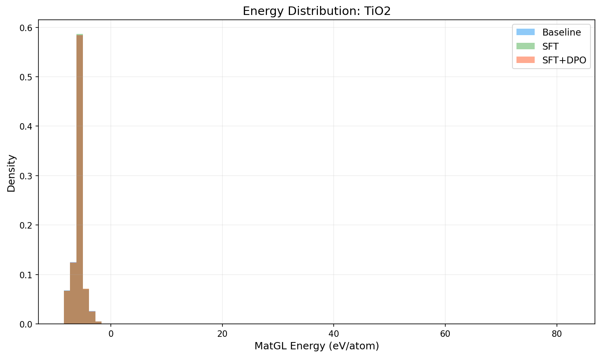
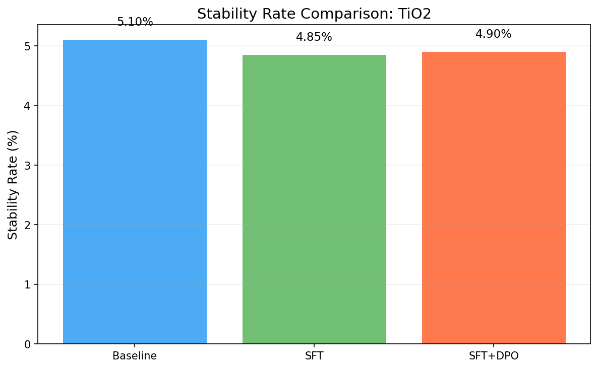
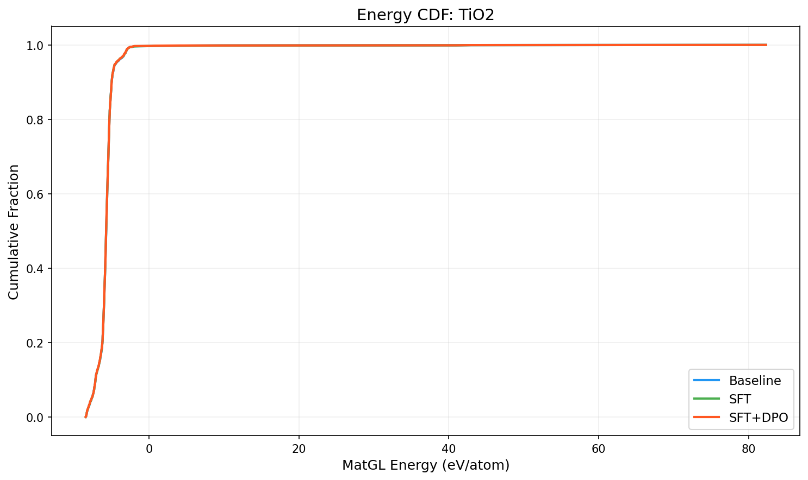

# Three-Way Comparison Report: TiO2

**Models**: Baseline vs SFT vs SFT+DPO

## 1. Key Metrics

| Metric | Baseline | SFT | SFT+DPO | SFT vs Base | SFT+DPO vs Base |
|--------|----------|-----|---------|-------------|----------------|
| Validity Rate | 1.0000 | 1.0000 | 1.0000 | +0.0000 | +0.0000 |
| **Stability Rate** | 0.0510 | 0.0485 | **0.0490** | -0.0025 | -0.0020 |
| Stable Count | 102 | 97 | 98 | -5 | -4 |
| Composition Hit Rate | 0.4580 | 0.4560 | 0.4575 | -0.0020 | -0.0005 |

## 2. MatGL Energy Distribution (eV/atom, lower is better)

| Metric | Baseline | SFT | SFT+DPO | SFT vs Base | SFT+DPO vs Base |
|--------|----------|-----|---------|-------------|----------------|
| Mean | -5.6891 | -5.6907 | -5.7011 | -0.0016 | -0.0121 |
| Median | -5.7182 | -5.7205 | -5.7220 | -0.0023 | -0.0038 |
| Std | 2.6936 | 2.6930 | 2.6720 | -0.0005 | -0.0215 |

**Baseline**: P10=-7.1530, P90=-4.9840, Best=-8.4507, Worst=82.3491
**SFT**: P10=-7.1427, P90=-4.9819, Best=-8.4507, Worst=82.3491
**SFT+DPO**: P10=-7.1501, P90=-4.9819, Best=-8.4507, Worst=82.3491

## 3. Composite Reward

| Metric | Baseline | SFT | SFT+DPO |
|--------|----------|-----|--------|
| R_energy | 0.5279 | 0.5283 | 0.5274 |
| R_structure | 0.5 | 0.5 | 0.5 |
| R_difficulty | 0.7704 | 0.3799 | 0.38 |
| R_composition | 0.729 | 0.9726 | 0.9726 |

## 4. Visualizations

## 5. Interpretation

SFT+DPO does not improve stability rate over baseline (delta=-0.20%). Consider tuning hyperparameters or increasing training data.

