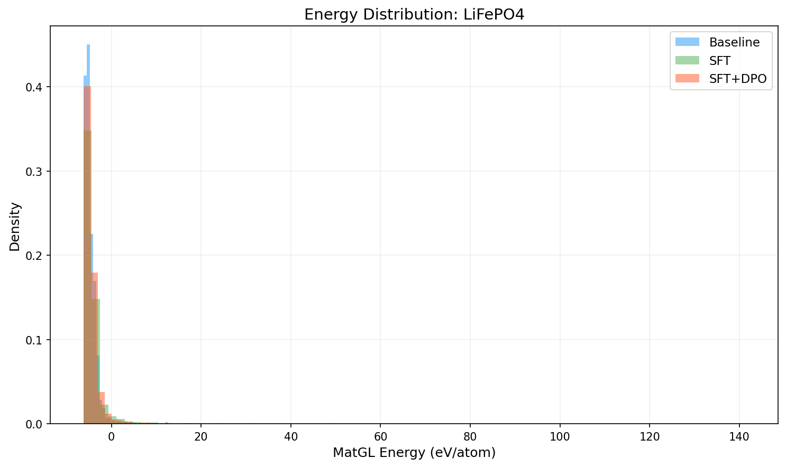
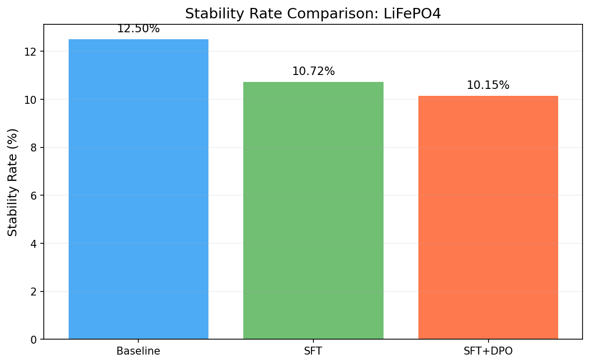
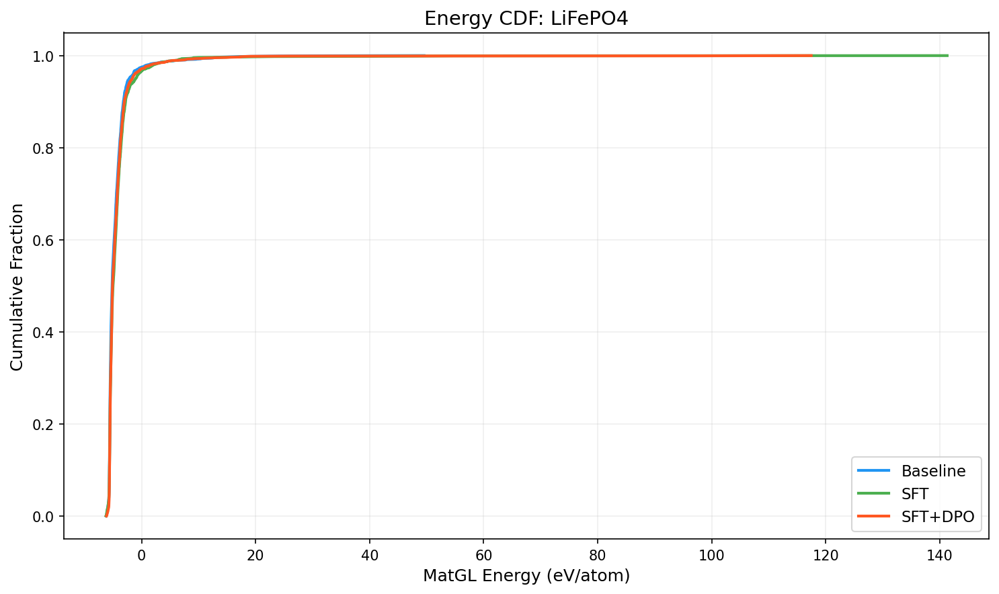

# Three-Way Comparison Report: LiFePO4

**Models**: Baseline vs SFT vs SFT+DPO

## 1. Key Metrics

| Metric | Baseline | SFT | SFT+DPO | SFT vs Base | SFT+DPO vs Base |
|--------|----------|-----|---------|-------------|----------------|
| Validity Rate | 1.0000 | 1.0000 | 1.0000 | +0.0000 | +0.0000 |
| **Stability Rate** | 0.1250 | 0.1072 | **0.1015** | -0.0178 | -0.0235 |
| Stable Count | 250 | 211 | 200 | -39 | -50 |
| Composition Hit Rate | 0.5090 | 0.5440 | 0.4825 | +0.0350 | -0.0265 |

## 2. MatGL Energy Distribution (eV/atom, lower is better)

| Metric | Baseline | SFT | SFT+DPO | SFT vs Base | SFT+DPO vs Base |
|--------|----------|-----|---------|-------------|----------------|
| Mean | -4.4646 | -4.1995 | -4.2820 | +0.2651 | +0.1826 |
| Median | -5.1652 | -4.9981 | -5.0918 | +0.1670 | +0.0734 |
| Std | 2.6218 | 4.3910 | 4.2152 | +1.7692 | +1.5934 |

**Baseline**: P10=-5.6263, P90=-3.1867, Best=-6.1918, Worst=49.5498
**SFT**: P10=-5.6235, P90=-2.8095, Best=-6.2390, Worst=141.2938
**SFT+DPO**: P10=-5.6118, P90=-3.0037, Best=-6.1393, Worst=117.4511

## 3. Composite Reward

| Metric | Baseline | SFT | SFT+DPO |
|--------|----------|-----|--------|
| R_proxy | 0.5034 | 0.4615 | 0.4777 |
| R_geom | 0.6671 | 0.6593 | 0.6627 |
| R_comp | 0.9890 | 0.9888 | 0.9877 |
| R_novel | 0.9950 | 0.6478 | 0.8295 |
| R_total | 0.6175 | 0.5526 | 0.5824 |

## 4. Visualizations

## 5. Interpretation

SFT+DPO does not improve stability rate over baseline (delta=-2.35%). Consider tuning hyperparameters or increasing training data.

