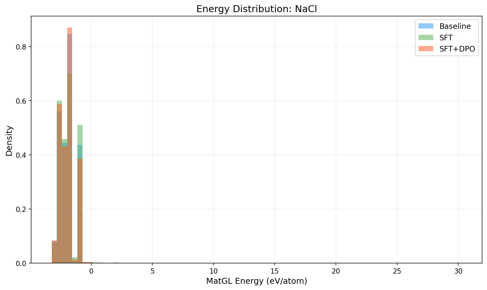
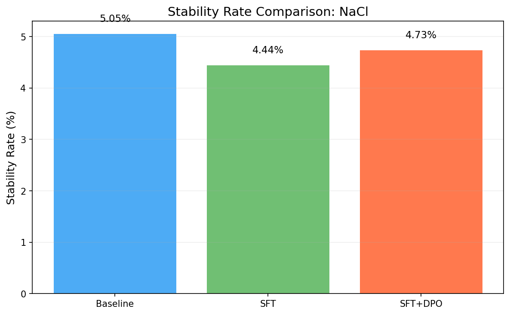
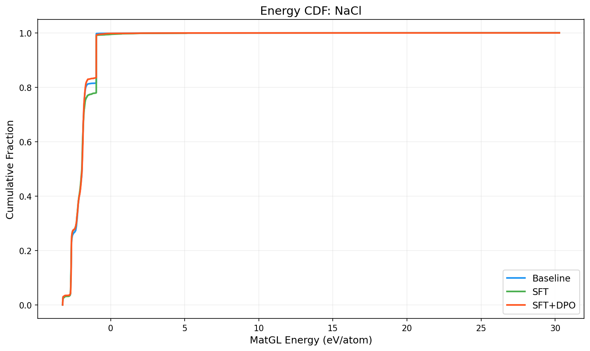

# Three-Way Comparison Report: NaCl

**Models**: Baseline vs SFT vs SFT+DPO

## 1. Key Metrics

| Metric | Baseline | SFT | SFT+DPO | SFT vs Base | SFT+DPO vs Base |
|--------|----------|-----|---------|-------------|----------------|
| Validity Rate | 1.0000 | 1.0000 | 1.0000 | +0.0000 | +0.0000 |
| **Stability Rate** | 0.0505 | 0.0444 | **0.0473** | -0.0061 | -0.0032 |
| Stable Count | 101 | 87 | 93 | -14 | -8 |
| Composition Hit Rate | 0.8865 | 0.8930 | 0.8915 | +0.0065 | +0.0050 |

## 2. MatGL Energy Distribution (eV/atom, lower is better)

| Metric | Baseline | SFT | SFT+DPO | SFT vs Base | SFT+DPO vs Base |
|--------|----------|-----|---------|-------------|----------------|
| Mean | -1.9610 | -1.9251 | -1.9750 | +0.0359 | -0.0140 |
| Median | -1.9303 | -1.9413 | -1.9265 | -0.0110 | +0.0039 |
| Std | 0.9648 | 1.0137 | 0.9656 | +0.0489 | +0.0008 |

**Baseline**: P10=-2.6785, P90=-0.9670, Best=-3.2415, Worst=30.2854
**SFT**: P10=-2.6851, P90=-0.9670, Best=-3.2349, Worst=30.2854
**SFT+DPO**: P10=-2.6717, P90=-0.9666, Best=-3.2344, Worst=30.2854

## 3. Composite Reward

| Metric | Baseline | SFT | SFT+DPO |
|--------|----------|-----|--------|
| R_proxy | 0.5891 | 0.5548 | 0.5044 |
| R_geom | 0.6305 | 0.6400 | 0.6244 |
| R_comp | 0.9929 | 0.9930 | 0.9935 |
| R_novel | 0.6473 | 0.3270 | 0.5012 |
| R_total | 0.6395 | 0.5844 | 0.5650 |

## 4. Visualizations

## 5. Interpretation

SFT+DPO does not improve stability rate over baseline (delta=-0.32%). Consider tuning hyperparameters or increasing training data.

