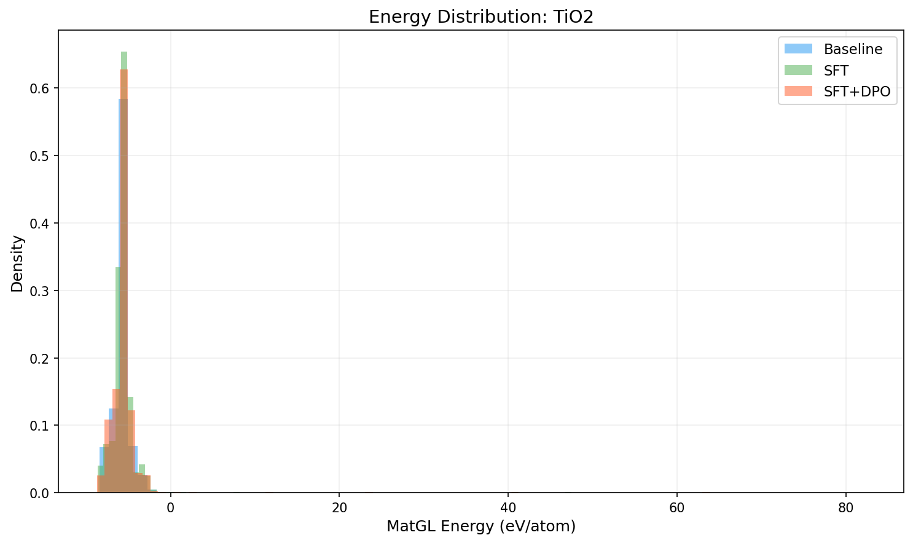
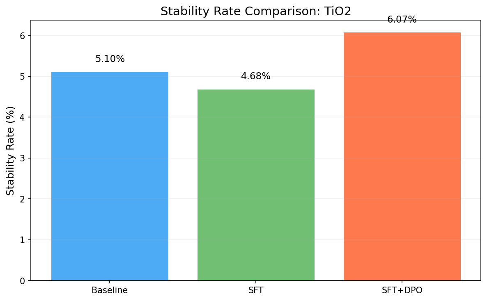
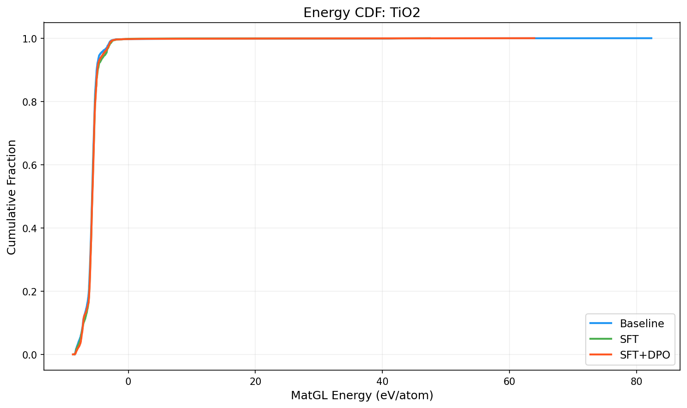

# Three-Way Comparison Report: TiO2

**Models**: Baseline vs SFT vs SFT+DPO

## 1. Key Metrics

| Metric | Baseline | SFT | SFT+DPO | SFT vs Base | SFT+DPO vs Base |
|--------|----------|-----|---------|-------------|----------------|
| Validity Rate | 1.0000 | 1.0000 | 1.0000 | +0.0000 | +0.0000 |
| **Stability Rate** | 0.0510 | 0.0468 | **0.0607** | -0.0042 | +0.0097 |
| Stable Count | 102 | 93 | 121 | -9 | +19 |
| Composition Hit Rate | 0.4580 | 0.3945 | 0.4285 | -0.0635 | -0.0295 |

## 2. MatGL Energy Distribution (eV/atom, lower is better)

| Metric | Baseline | SFT | SFT+DPO | SFT vs Base | SFT+DPO vs Base |
|--------|----------|-----|---------|-------------|----------------|
| Mean | -5.6891 | -5.6320 | -5.6212 | +0.0571 | +0.0678 |
| Median | -5.7182 | -5.6794 | -5.6712 | +0.0388 | +0.0470 |
| Std | 2.6936 | 1.9124 | 2.2539 | -0.7812 | -0.4397 |

**Baseline**: P10=-7.1530, P90=-4.9840, Best=-8.4507, Worst=82.3491
**SFT**: P10=-7.0603, P90=-4.8245, Best=-8.6564, Worst=47.4542
**SFT+DPO**: P10=-7.1216, P90=-4.8772, Best=-8.7411, Worst=63.9086

## 3. Composite Reward

| Metric | Baseline | SFT | SFT+DPO |
|--------|----------|-----|--------|
| R_proxy | 0.5034 | 0.4818 | 0.4894 |
| R_geom | 0.6881 | 0.6857 | 0.6853 |
| R_comp | 0.9728 | 0.9698 | 0.9712 |
| R_novel | 0.8509 | 0.4328 | 0.6633 |
| R_total | 0.6036 | 0.5461 | 0.5745 |

## 4. Visualizations

## 5. Interpretation

SFT+DPO shows a marginal improvement of **0.97%** in stability rate over baseline. This may be within noise; larger samples are recommended.

