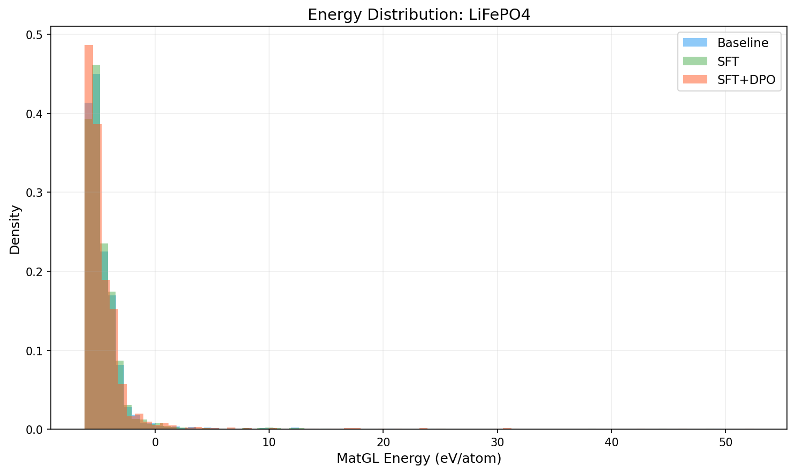
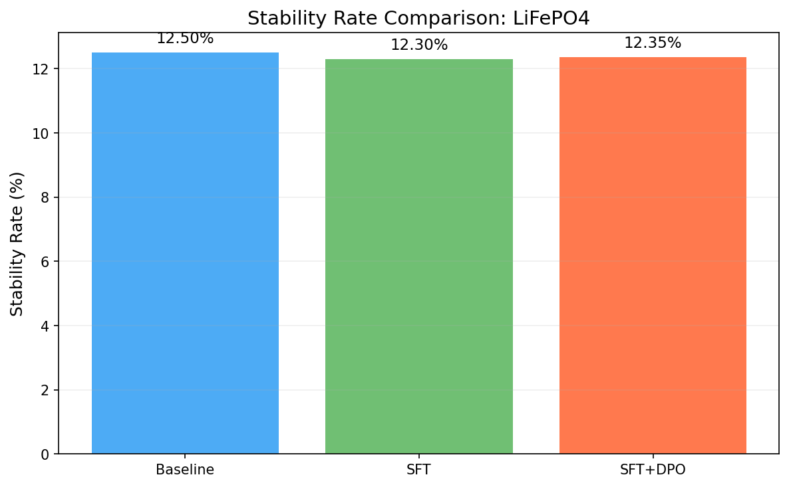
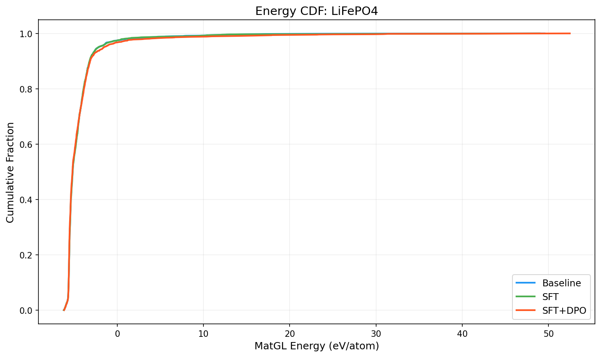

# Three-Way Comparison Report: LiFePO4

**Models**: Baseline vs SFT vs SFT+DPO

## 1. Key Metrics

| Metric | Baseline | SFT | SFT+DPO | SFT vs Base | SFT+DPO vs Base |
|--------|----------|-----|---------|-------------|----------------|
| Validity Rate | 1.0000 | 1.0000 | 1.0000 | +0.0000 | +0.0000 |
| **Stability Rate** | 0.1250 | 0.1230 | **0.1235** | -0.0020 | -0.0015 |
| Stable Count | 250 | 246 | 247 | -4 | -3 |
| Composition Hit Rate | 0.5090 | 0.5130 | 0.5100 | +0.0040 | +0.0010 |

## 2. MatGL Energy Distribution (eV/atom, lower is better)

| Metric | Baseline | SFT | SFT+DPO | SFT vs Base | SFT+DPO vs Base |
|--------|----------|-----|---------|-------------|----------------|
| Mean | -4.4646 | -4.4383 | -4.2987 | +0.0263 | +0.1659 |
| Median | -5.1652 | -5.1615 | -5.1848 | +0.0036 | -0.0197 |
| Std | 2.6218 | 2.9344 | 3.5943 | +0.3126 | +0.9725 |

**Baseline**: P10=-5.6263, P90=-3.1867, Best=-6.1918, Worst=49.5498
**SFT**: P10=-5.6275, P90=-3.1950, Best=-6.1964, Worst=48.9680
**SFT+DPO**: P10=-5.6264, P90=-3.1386, Best=-6.1563, Worst=52.4725

## 3. Composite Reward

| Metric | Baseline | SFT | SFT+DPO |
|--------|----------|-----|--------|
| R_proxy | 0.5034 | 0.5009 | 0.5174 |
| R_geom | 0.6671 | 0.6679 | 0.6666 |
| R_comp | 0.9890 | 0.9890 | 0.9894 |
| R_novel | 0.9950 | 0.0726 | 0.8427 |
| R_total | 0.6175 | 0.5236 | 0.6120 |

## 4. Visualizations

## 5. Interpretation

SFT+DPO does not improve stability rate over baseline (delta=-0.15%). Consider tuning hyperparameters or increasing training data.

