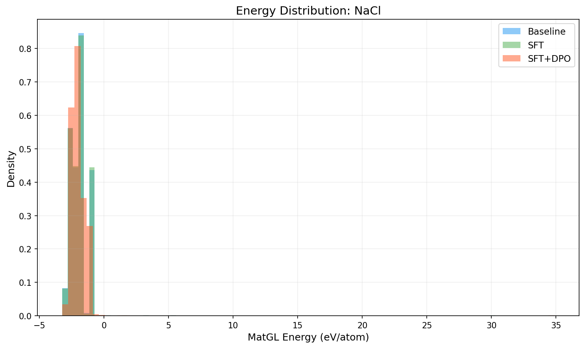
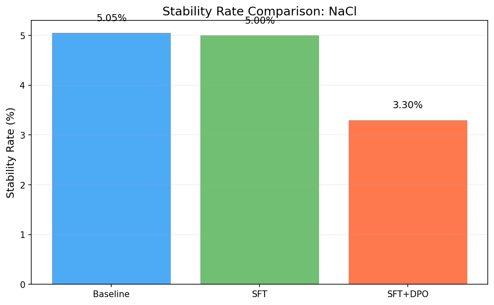
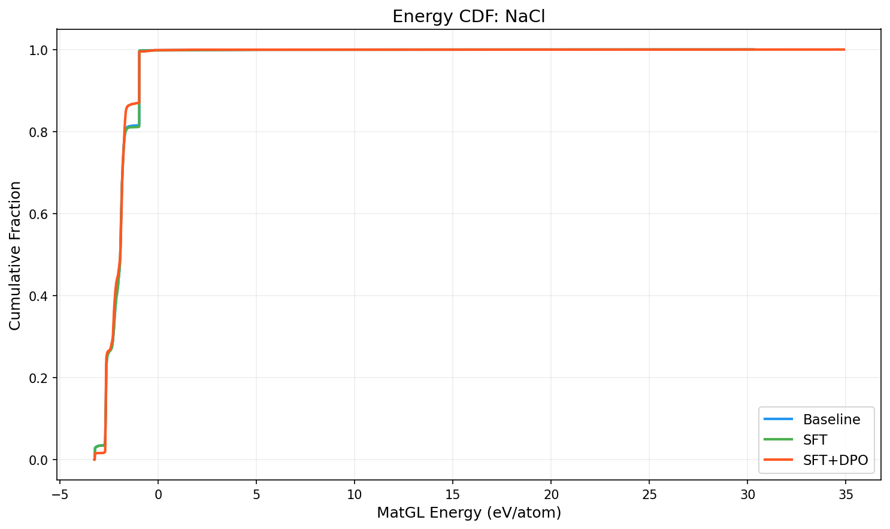

# Three-Way Comparison Report: NaCl

**Models**: Baseline vs SFT vs SFT+DPO

## 1. Key Metrics

| Metric | Baseline | SFT | SFT+DPO | SFT vs Base | SFT+DPO vs Base |
|--------|----------|-----|---------|-------------|----------------|
| Validity Rate | 1.0000 | 1.0000 | 1.0000 | +0.0000 | +0.0000 |
| **Stability Rate** | 0.0505 | 0.0500 | **0.0330** | -0.0005 | -0.0175 |
| Stable Count | 101 | 100 | 66 | -1 | -35 |
| Composition Hit Rate | 0.8865 | 0.8870 | 0.8780 | +0.0005 | -0.0085 |

## 2. MatGL Energy Distribution (eV/atom, lower is better)

| Metric | Baseline | SFT | SFT+DPO | SFT vs Base | SFT+DPO vs Base |
|--------|----------|-----|---------|-------------|----------------|
| Mean | -1.9610 | -1.9561 | -2.0013 | +0.0049 | -0.0403 |
| Median | -1.9303 | -1.9305 | -1.9326 | -0.0002 | -0.0022 |
| Std | 0.9648 | 0.9690 | 1.0013 | +0.0042 | +0.0366 |

**Baseline**: P10=-2.6785, P90=-0.9670, Best=-3.2415, Worst=30.2854
**SFT**: P10=-2.6785, P90=-0.9670, Best=-3.2415, Worst=30.2854
**SFT+DPO**: P10=-2.6774, P90=-0.9673, Best=-3.2496, Worst=34.8895

## 3. Composite Reward

| Metric | Baseline | SFT | SFT+DPO |
|--------|----------|-----|--------|
| R_proxy | 0.5891 | 0.5498 | 0.4995 |
| R_geom | 0.6305 | 0.6304 | 0.6242 |
| R_comp | 0.9929 | 0.9930 | 0.9929 |
| R_novel | 0.6473 | 0.0338 | 0.5072 |
| R_total | 0.6395 | 0.5505 | 0.5621 |

## 4. Visualizations

## 5. Interpretation

SFT+DPO does not improve stability rate over baseline (delta=-1.75%). Consider tuning hyperparameters or increasing training data.

