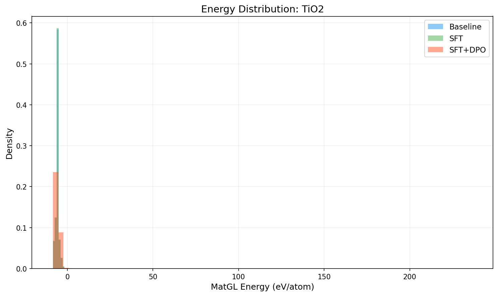
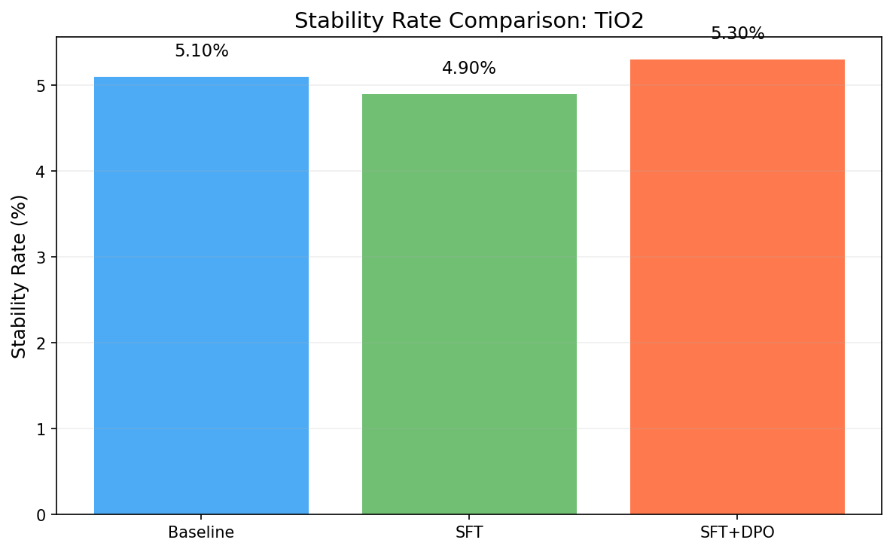
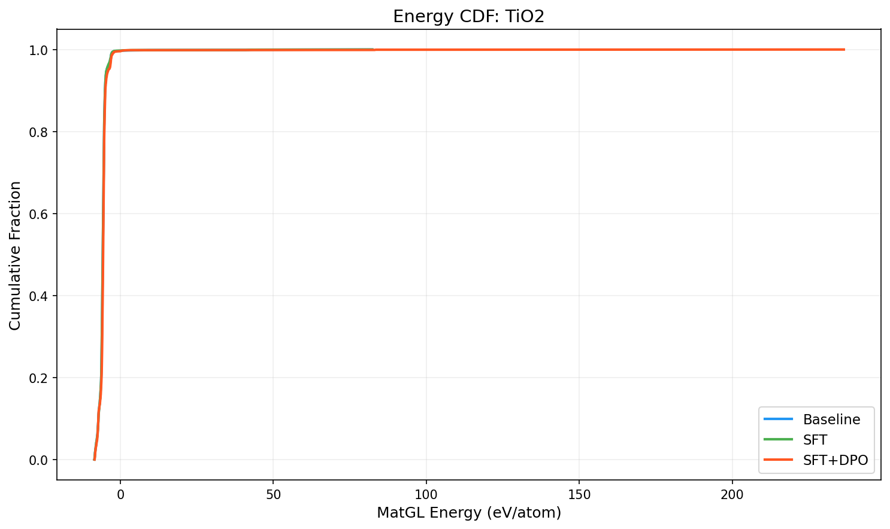

# Three-Way Comparison Report: TiO2

**Models**: Baseline vs SFT vs SFT+DPO

## 1. Key Metrics

| Metric | Baseline | SFT | SFT+DPO | SFT vs Base | SFT+DPO vs Base |
|--------|----------|-----|---------|-------------|----------------|
| Validity Rate | 1.0000 | 1.0000 | 1.0000 | +0.0000 | +0.0000 |
| **Stability Rate** | 0.0510 | 0.0490 | **0.0530** | -0.0020 | +0.0020 |
| Stable Count | 102 | 98 | 106 | -4 | +4 |
| Composition Hit Rate | 0.4580 | 0.4550 | 0.4860 | -0.0030 | +0.0280 |

## 2. MatGL Energy Distribution (eV/atom, lower is better)

| Metric | Baseline | SFT | SFT+DPO | SFT vs Base | SFT+DPO vs Base |
|--------|----------|-----|---------|-------------|----------------|
| Mean | -5.6891 | -5.6970 | -5.4587 | -0.0079 | +0.2304 |
| Median | -5.7182 | -5.7177 | -5.6017 | +0.0004 | +0.1165 |
| Std | 2.6936 | 2.6708 | 6.1921 | -0.0228 | +3.4985 |

**Baseline**: P10=-7.1530, P90=-4.9840, Best=-8.4507, Worst=82.3491
**SFT**: P10=-7.1387, P90=-4.9840, Best=-8.4507, Worst=82.3491
**SFT+DPO**: P10=-7.1637, P90=-4.8678, Best=-8.3971, Worst=236.4803

## 3. Composite Reward

| Metric | Baseline | SFT | SFT+DPO |
|--------|----------|-----|--------|
| R_proxy | 0.5034 | 0.5017 | 0.4606 |
| R_geom | 0.6881 | 0.6880 | 0.6871 |
| R_comp | 0.9728 | 0.9727 | 0.9741 |
| R_novel | 0.8509 | 0.0413 | 0.6916 |
| R_total | 0.6036 | 0.5214 | 0.5577 |

## 4. Visualizations

## 5. Interpretation

SFT+DPO shows a marginal improvement of **0.20%** in stability rate over baseline. This may be within noise; larger samples are recommended.

