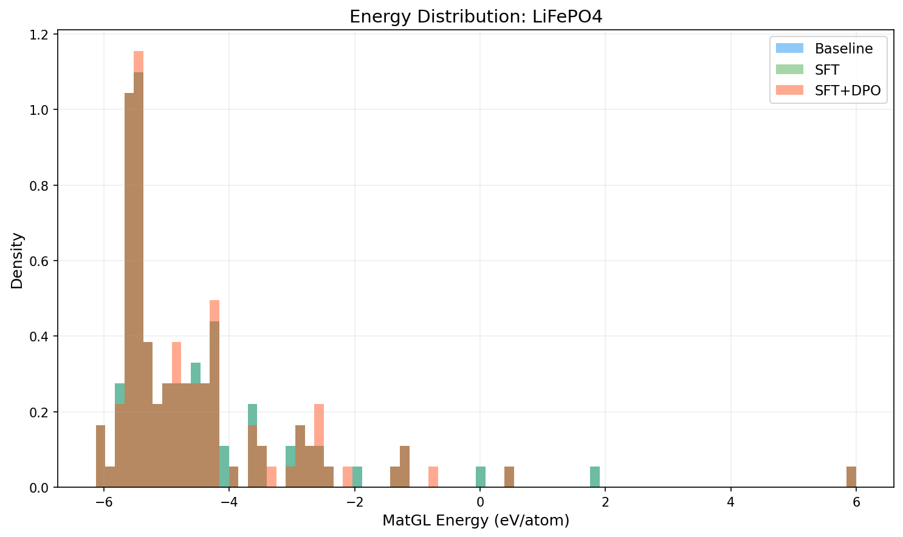
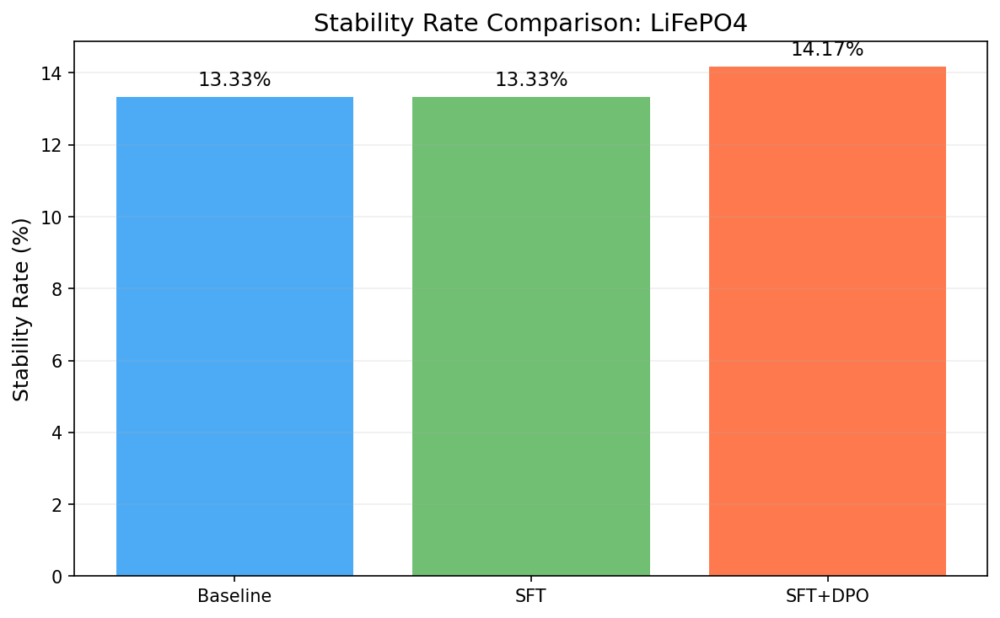
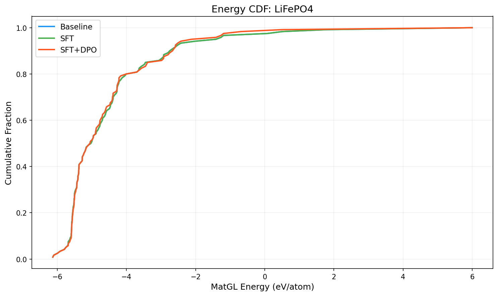

# Three-Way Comparison Report: LiFePO4

**Models**: Baseline vs SFT vs SFT+DPO

## 1. Key Metrics

| Metric | Baseline | SFT | SFT+DPO | SFT vs Base | SFT+DPO vs Base |
|--------|----------|-----|---------|-------------|----------------|
| Validity Rate | 1.0000 | 1.0000 | 1.0000 | +0.0000 | +0.0000 |
| **Stability Rate** | 0.1333 | 0.1333 | **0.1417** | +0.0000 | +0.0084 |
| Stable Count | 16 | 16 | 17 | +0 | +1 |
| Composition Hit Rate | 0.4917 | 0.4917 | 0.4917 | +0.0000 | +0.0000 |

## 2. MatGL Energy Distribution (eV/atom, lower is better)

| Metric | Baseline | SFT | SFT+DPO | SFT vs Base | SFT+DPO vs Base |
|--------|----------|-----|---------|-------------|----------------|
| Mean | -4.4995 | -4.4995 | -4.5470 | +0.0000 | -0.0475 |
| Median | -5.0165 | -5.0165 | -5.0521 | +0.0000 | -0.0357 |
| Std | 1.6774 | 1.6774 | 1.5701 | +0.0000 | -0.1073 |

**Baseline**: P10=-5.5981, P90=-2.6709, Best=-6.1312, Worst=5.9980
**SFT**: P10=-5.5981, P90=-2.6709, Best=-6.1312, Worst=5.9980
**SFT+DPO**: P10=-5.5946, P90=-2.6328, Best=-6.1312, Worst=5.9980

## 3. Composite Reward

| Metric | Baseline | SFT | SFT+DPO |
|--------|----------|-----|--------|
| R_proxy | 0.5000 | 0.5025 | 0.5017 |
| R_geom | 0.6596 | 0.6596 | 0.6620 |
| R_comp | 0.9874 | 0.9874 | 0.9874 |
| R_novel | 1.0000 | 0.0000 | 0.0000 |
| R_total | 0.6147 | 0.5165 | 0.5161 |

## 4. Visualizations

## 5. Interpretation

SFT+DPO shows a marginal improvement of **0.84%** in stability rate over baseline. This may be within noise; larger samples are recommended.

