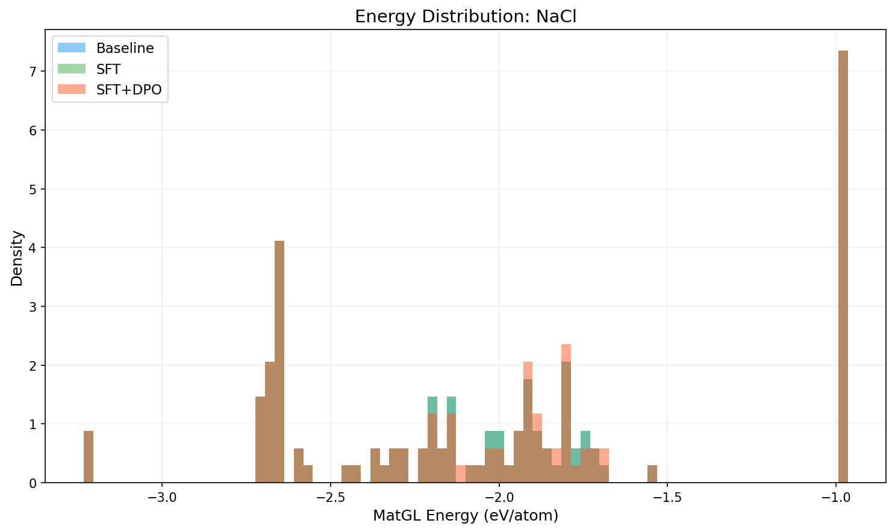
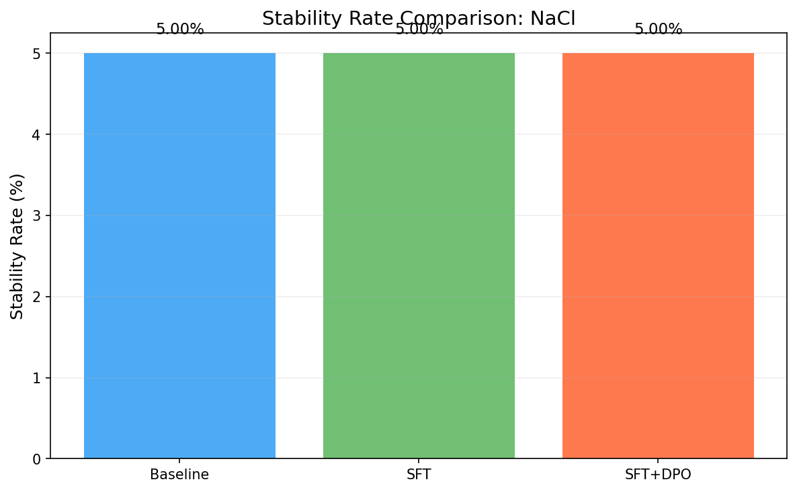
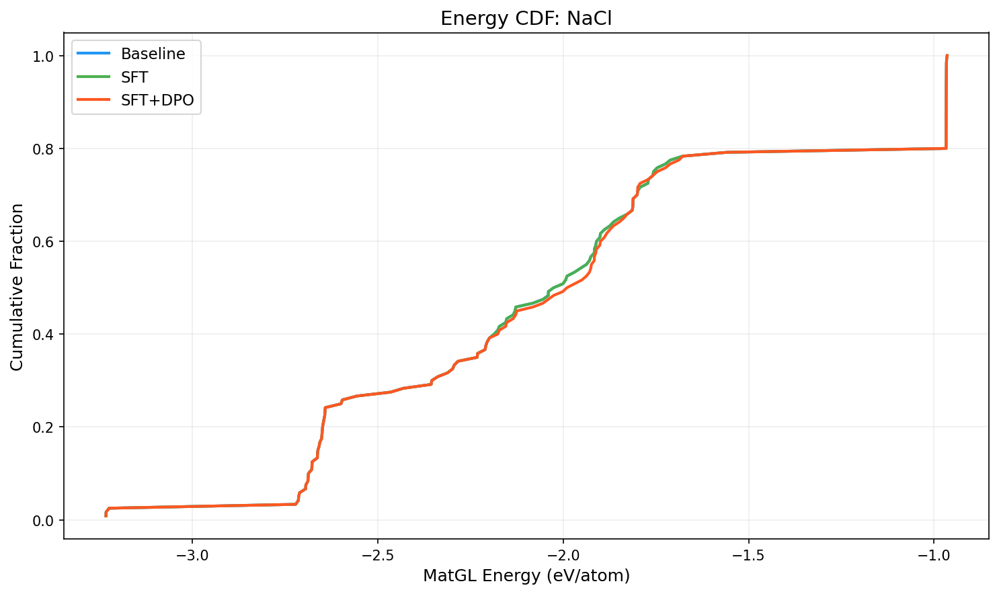

# Three-Way Comparison Report: NaCl

**Models**: Baseline vs SFT vs SFT+DPO

## 1. Key Metrics

| Metric | Baseline | SFT | SFT+DPO | SFT vs Base | SFT+DPO vs Base |
|--------|----------|-----|---------|-------------|----------------|
| Validity Rate | 1.0000 | 1.0000 | 1.0000 | +0.0000 | +0.0000 |
| **Stability Rate** | 0.0500 | 0.0500 | **0.0500** | +0.0000 | +0.0000 |
| Stable Count | 6 | 6 | 6 | +0 | +0 |
| Composition Hit Rate | 0.8417 | 0.8417 | 0.8417 | +0.0000 | +0.0000 |

## 2. MatGL Energy Distribution (eV/atom, lower is better)

| Metric | Baseline | SFT | SFT+DPO | SFT vs Base | SFT+DPO vs Base |
|--------|----------|-----|---------|-------------|----------------|
| Mean | -1.9798 | -1.9798 | -1.9746 | +0.0000 | +0.0052 |
| Median | -2.0137 | -2.0137 | -1.9801 | +0.0000 | +0.0337 |
| Std | 0.6268 | 0.6268 | 0.6268 | +0.0000 | +0.0000 |

**Baseline**: P10=-2.6785, P90=-0.9671, Best=-3.2337, Worst=-0.9645
**SFT**: P10=-2.6785, P90=-0.9671, Best=-3.2337, Worst=-0.9645
**SFT+DPO**: P10=-2.6785, P90=-0.9670, Best=-3.2337, Worst=-0.9645

## 3. Composite Reward

| Metric | Baseline | SFT | SFT+DPO |
|--------|----------|-----|--------|
| R_proxy | 0.6032 | 0.5591 | 0.5267 |
| R_geom | 0.6149 | 0.6149 | 0.6148 |
| R_comp | 0.9897 | 0.9897 | 0.9897 |
| R_novel | 0.8842 | 0.0000 | 0.0421 |
| R_total | 0.6711 | 0.5518 | 0.5334 |

## 4. Visualizations

## 5. Interpretation

SFT+DPO does not improve stability rate over baseline (delta=0.00%). Consider tuning hyperparameters or increasing training data.

