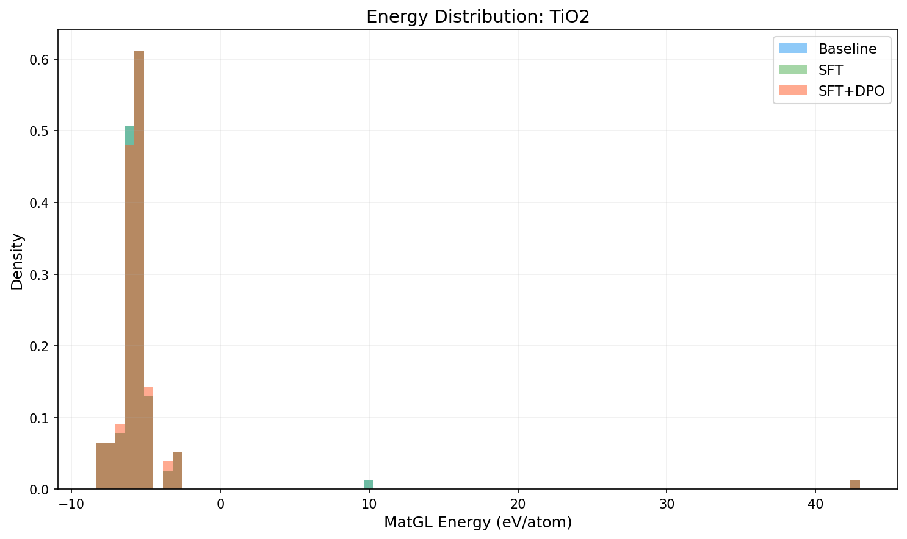
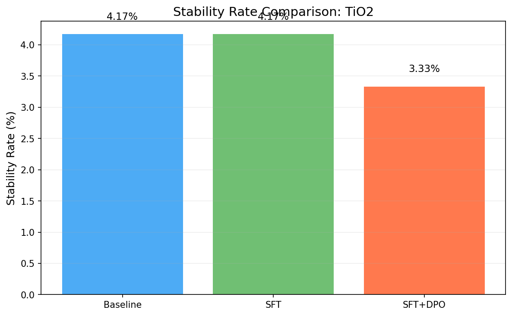
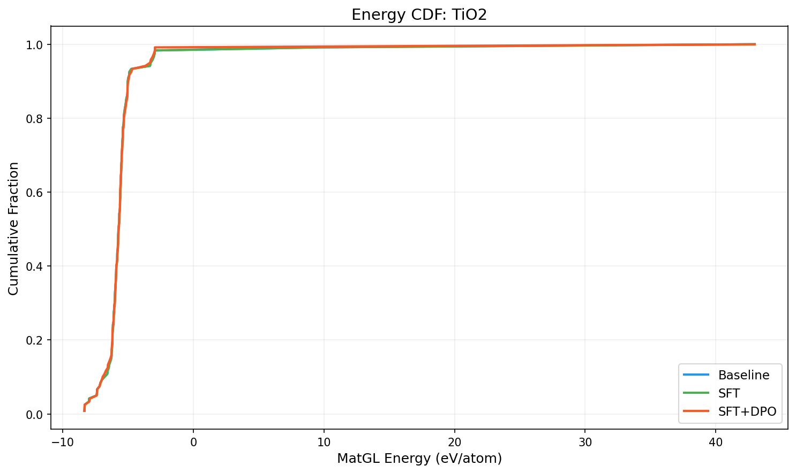

# Three-Way Comparison Report: TiO2

**Models**: Baseline vs SFT vs SFT+DPO

## 1. Key Metrics

| Metric | Baseline | SFT | SFT+DPO | SFT vs Base | SFT+DPO vs Base |
|--------|----------|-----|---------|-------------|----------------|
| Validity Rate | 1.0000 | 1.0000 | 1.0000 | +0.0000 | +0.0000 |
| **Stability Rate** | 0.0417 | 0.0417 | **0.0333** | +0.0000 | -0.0084 |
| Stable Count | 5 | 5 | 4 | +0 | -1 |
| Composition Hit Rate | 0.3667 | 0.3667 | 0.3750 | +0.0000 | +0.0083 |

## 2. MatGL Energy Distribution (eV/atom, lower is better)

| Metric | Baseline | SFT | SFT+DPO | SFT vs Base | SFT+DPO vs Base |
|--------|----------|-----|---------|-------------|----------------|
| Mean | -5.2250 | -5.2250 | -5.3345 | +0.0000 | -0.1094 |
| Median | -5.7179 | -5.7179 | -5.6973 | +0.0000 | +0.0205 |
| Std | 4.7473 | 4.7473 | 4.5492 | +0.0000 | -0.1982 |

**Baseline**: P10=-6.5799, P90=-4.9840, Best=-8.3329, Worst=42.9726
**SFT**: P10=-6.5799, P90=-4.9840, Best=-8.3329, Worst=42.9726
**SFT+DPO**: P10=-6.7975, P90=-4.9321, Best=-8.3329, Worst=42.9726

## 3. Composite Reward

| Metric | Baseline | SFT | SFT+DPO |
|--------|----------|-----|--------|
| R_proxy | 0.5076 | 0.5057 | 0.4985 |
| R_geom | 0.6794 | 0.6794 | 0.6784 |
| R_comp | 0.9678 | 0.9678 | 0.9681 |
| R_novel | 0.9661 | 0.0000 | 0.0420 |
| R_total | 0.6167 | 0.5187 | 0.5178 |

## 4. Visualizations

## 5. Interpretation

SFT+DPO does not improve stability rate over baseline (delta=-0.84%). Consider tuning hyperparameters or increasing training data.

