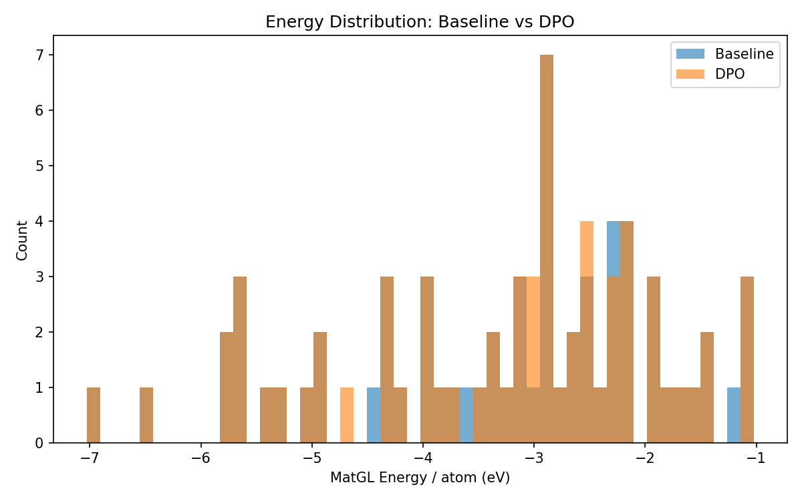
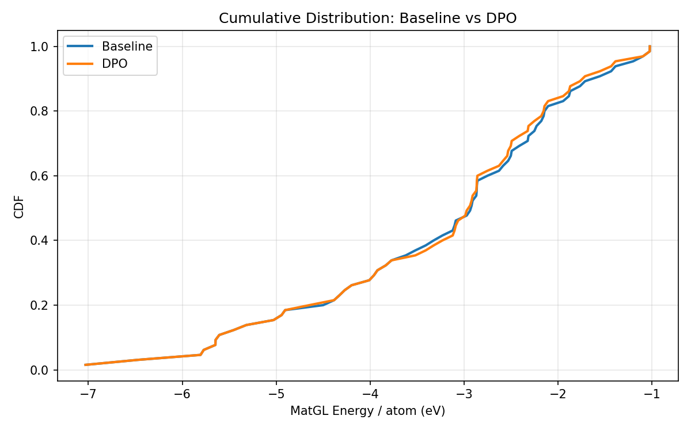
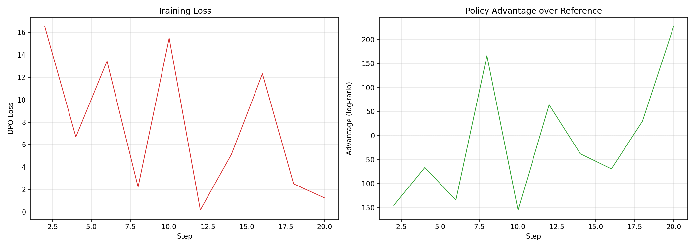

# DPO-CrystaLLM Comparison Report: LiFePO4

## 1. Key Metrics (Done Criteria)

| Metric | Baseline | DPO | Change |
|--------|----------|-----|--------|
| **Validity Rate** | 1.0000 | 1.0000 | +0.0000 |
| **Stability Rate** (Ehull<0.05) | 0.9846 | 0.9846 | +0.0000 |
| **Efficiency** (GPU s/stable) | 7.5s | 7.4s | - |
| **Novelty** | N/A | N/A | N/A |
| Composition Hit Rate | 0.0000 | 0.0000 | +0.0000 |

## 2. MatGL Energy / Atom (eV, lower is better)

| Metric | Baseline | DPO | Change |
|--------|----------|-----|--------|
| Mean | -3.260899 | -3.286847 | -0.025948 |
| Median | -2.920719 | -2.937036 | -0.016317 |
| Std | 1.437828 | 1.413366 | -0.024462 |
| P10 (best 10%) | -5.606209 | -5.606209 | +0.000000 |
| P90 | -1.555962 | -1.713553 | -0.157591 |
| Best | -7.028922 | -7.028922 | +0.000000 |
| Worst | -1.024032 | -1.024032 | +0.000000 |

## 3. Visualizations

### Energy Distribution


### Cumulative Distribution


### Training Loss



## 4. Failure Analysis

### Baseline Generation

- Requested: 100
- Successful: 86
- Valid rate: 0.86
- Failure breakdown:
  - `validation_error_ZeroDivisionError`: 59
  - `validation_error_AssertionError`: 18
  - `no_data_block`: 2
  - `validation_error_ValueError`: 2
  - `n_sites_out_of_range_1`: 1

### DPO Generation

- Requested: 100
- Successful: 86
- Valid rate: 0.86
- Failure breakdown:
  - `validation_error_ZeroDivisionError`: 57
  - `validation_error_AssertionError`: 16
  - `no_data_block`: 4
  - `validation_error_ValueError`: 2
  - `n_sites_out_of_range_1`: 1


## 5. Detailed Counts

### Baseline
- Total: 86
- Valid: 86 (100.00%)
- Hit target: 0 (0.00%)
- Scored: 65

### DPO
- Total: 86
- Valid: 86 (100.00%)
- Hit target: 0 (0.00%)
- Scored: 65


## 6. Reproducibility

To reproduce this experiment:
```bash
cd experiments/<exp_name>
# Fresh run:
bash run.sh
# Resume from last checkpoint:
RESUME=1 bash run.sh
```
