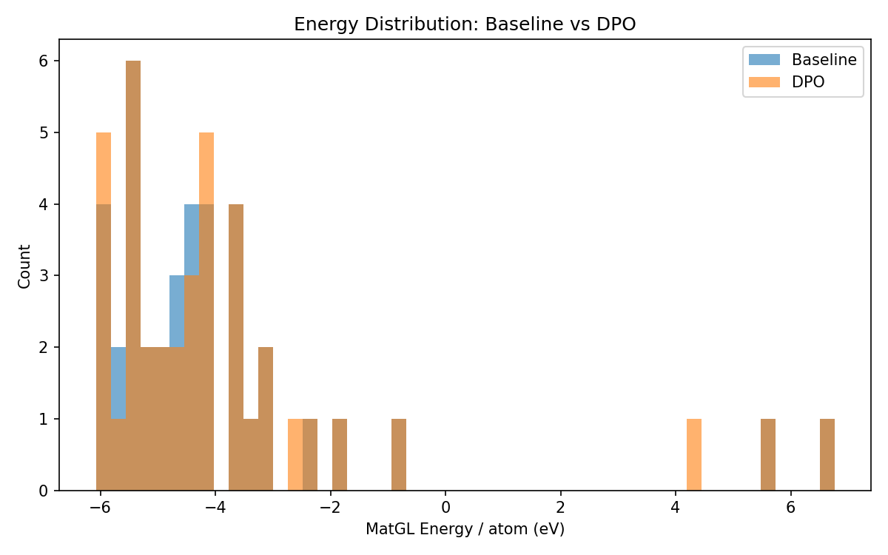
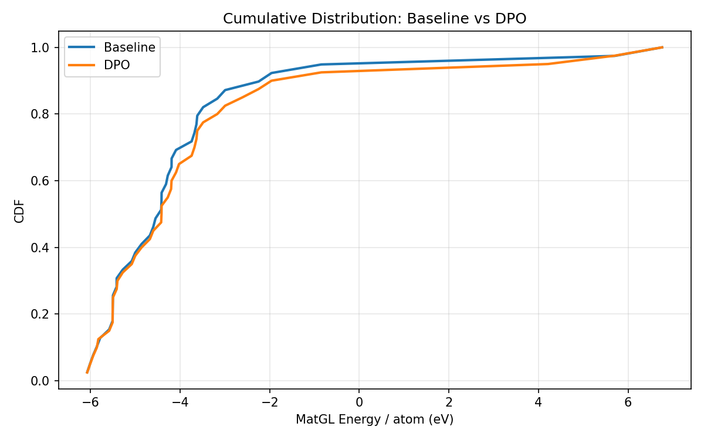
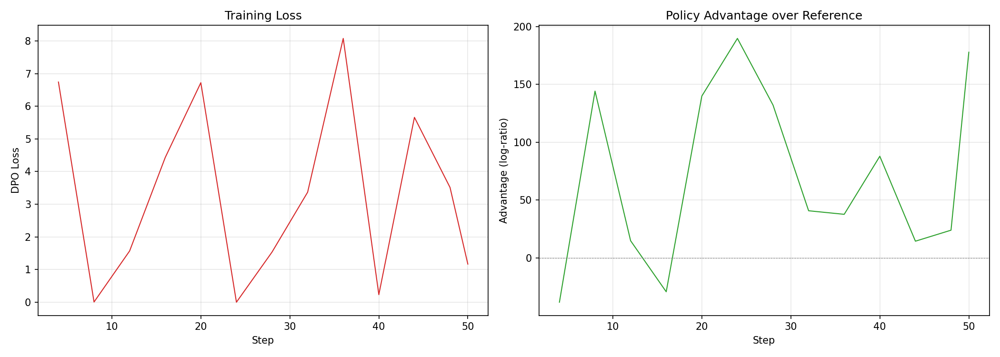

# DPO-CrystaLLM Comparison Report: LiFePO4

## 1. Key Metrics (Done Criteria)

| Metric | Baseline | DPO | Change |
|--------|----------|-----|--------|
| **Validity Rate** | 1.0000 | 1.0000 | +0.0000 |
| **Stability Rate** (Ehull<0.05) | 0.1282 | 0.1250 | -0.0032 |
| **Efficiency** (GPU s/stable) | 103.9s | 102.2s | - |
| **Novelty** | N/A | N/A | N/A |
| Composition Hit Rate | 0.5068 | 0.5135 | +0.0067 |

## 2. MatGL Energy / Atom (eV, lower is better)

| Metric | Baseline | DPO | Change |
|--------|----------|-----|--------|
| Mean | -3.934307 | -3.675666 | +0.258641 |
| Median | -4.424765 | -4.415865 | +0.008900 |
| Std | 2.666392 | 2.931630 | +0.265238 |
| P10 (best 10%) | -5.860554 | -5.826880 | +0.033674 |
| P90 | -1.960141 | -0.847679 | +1.112462 |
| Best | -6.076520 | -6.076520 | +0.000000 |
| Worst | 6.759610 | 6.759610 | +0.000000 |

## 3. Visualizations

### Energy Distribution


### Cumulative Distribution


### Training Loss



## 4. Failure Analysis

### Baseline Generation

- Requested: 100
- Successful: 73
- Valid rate: 0.73
- Failure breakdown:
  - `validation_error_ZeroDivisionError`: 93
  - `validation_error_AssertionError`: 16

### DPO Generation

- Requested: 100
- Successful: 74
- Valid rate: 0.74
- Failure breakdown:
  - `validation_error_ZeroDivisionError`: 91
  - `validation_error_AssertionError`: 16


## 5. Detailed Counts

### Baseline
- Total: 73
- Valid: 73 (100.00%)
- Hit target: 37 (50.68%)
- Scored: 39

### DPO
- Total: 74
- Valid: 74 (100.00%)
- Hit target: 38 (51.35%)
- Scored: 40


## 6. Reproducibility

To reproduce this experiment:
```bash
cd experiments/<exp_name>
# Fresh run:
bash run.sh
# Resume from last checkpoint:
RESUME=1 bash run.sh
```
